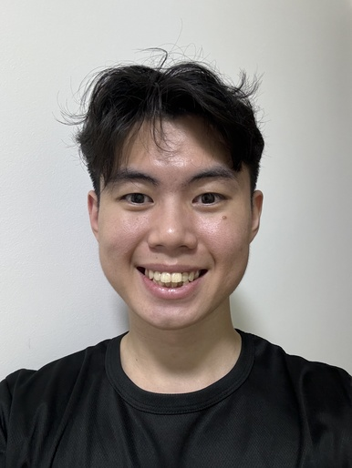
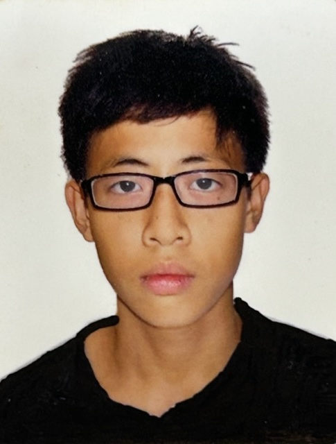
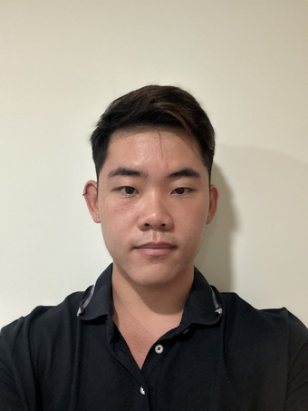
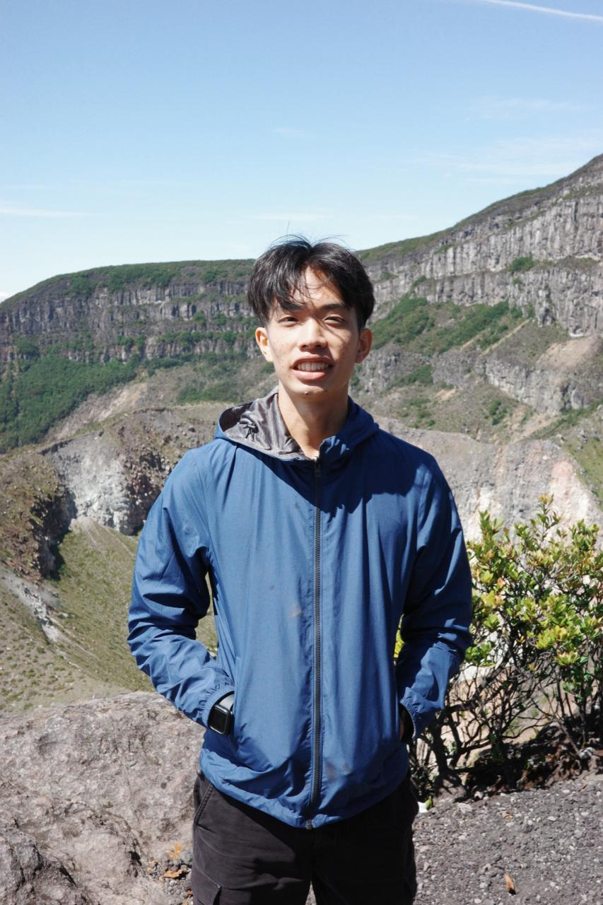
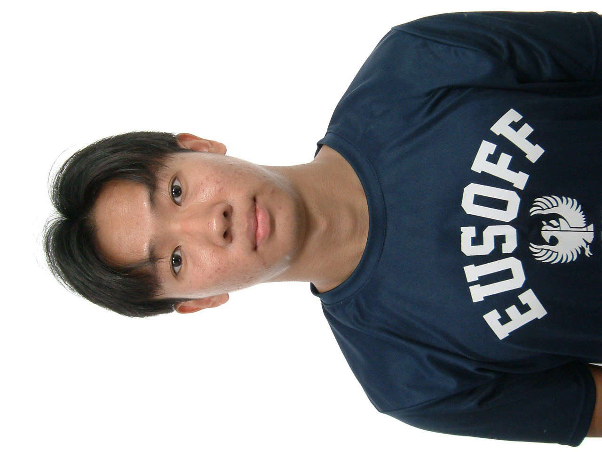

# About Us

We are a team based in the [School of Computing, National University of Singapore](http://www.comp.nus.edu.sg).

You can reach us at the email `seer[at]comp.nus.edu.sg`

## Project team

### Jovan Ng

[[github](https://github.com/jovnc)]
[[portfolio](team/johndoe.md)]

* Role: Developer
* Responsibilities: Team and player management features

### Chin Yuan Tian

[[github](http://github.com/yuanz03)]
[[portfolio](team/johndoe.md)]

* Role: Team Lead
* Responsibilities: Injury Status of Players

### Low Qi Jun, Cheka

[[github](http://github.com/ChekaLowQiJun)] [[portfolio](team/johndoe.md)]

* Role: Developer
* Responsibilities: Filtering Player's information

### Gabriel Tang

[[github](http://github.com/gabrieltang515)]
[[portfolio](team/johndoe.md)]

* Role: Developer
* Responsibilities: Position-related features

### James Doe

[[github](http://github.com/juink4i)]
[[portfolio](team/johndoe.md)]

* Role: Developer
* Responsibilities: Other player metadata
