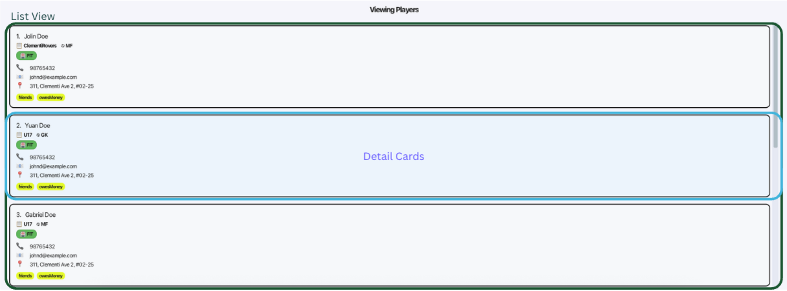
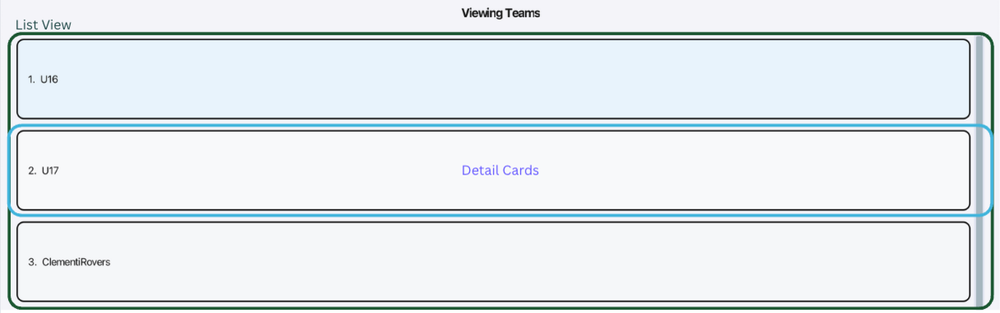
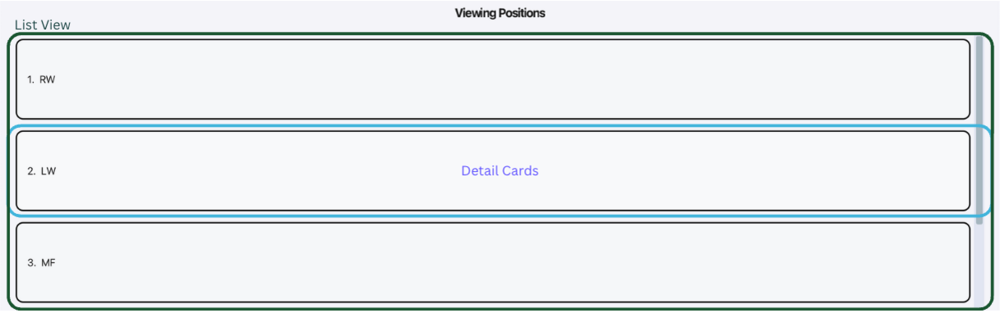
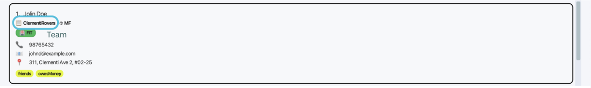
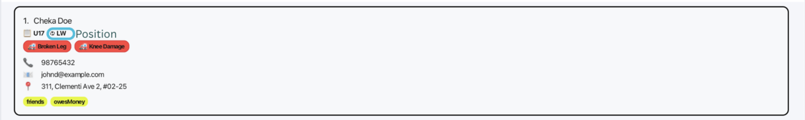
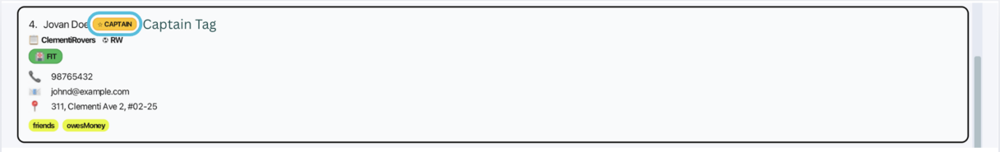
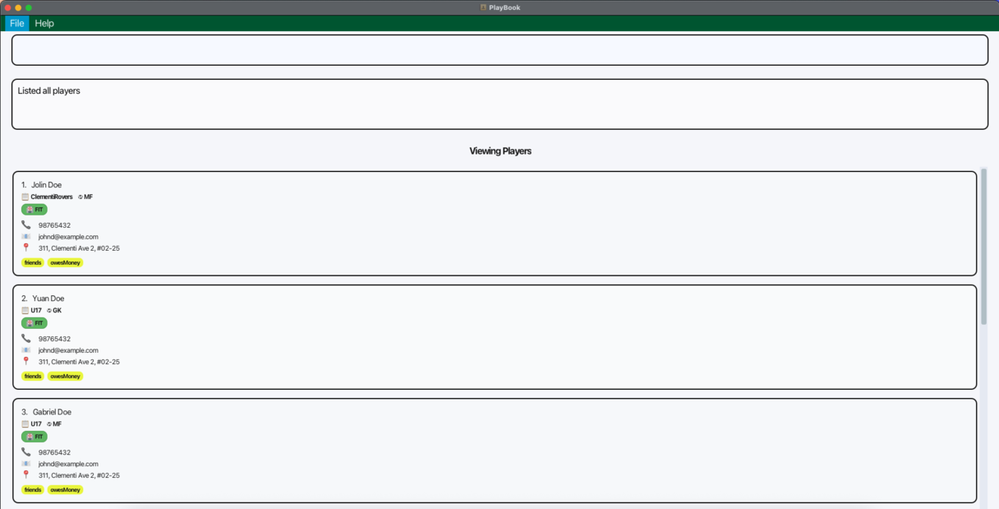
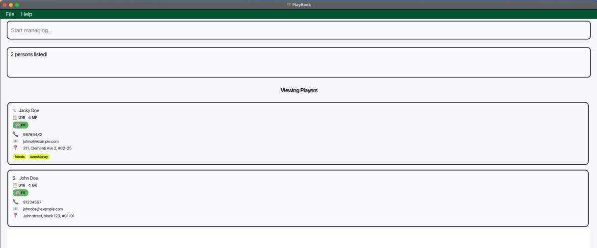

# PlayBook User Guide

#### Table of Contents

- [PlayBook User Guide](#playbook-user-guide) 
    - [Introduction](#introduction)
        - [Who should use PlayBook?](#who-should-use-playbook) 
        - [Why PlayBook?](#why-playbook)
    - [Quick start](#quick-start)
        - [1. Verify Java installation](#1-verify-java-installation)
        - [2. Download PlayBook](#2-download-playbook)
        - [3. Launch the application](#3-launch-the-application)
        - [4. Understanding the interface](#4-understanding-the-interface)
        - [5. Try your first commands](#5-try-your-first-commands)
        - [Next steps](#next-steps)
    - [Command Reference](#command-reference)
        - [Command Format Conventions](#command-format-conventions)
        - [Global Feature Behaviours](#global-feature-behaviours)
        - [Field Requirements](#field-requirements)
    - [Features](#features)
        - [Viewing help: `help`](#viewing-help-help)
        - [Adding a team: `addteam`](#adding-a-team-addteam)
        - [Adding a player: `add`](#adding-a-player-add)
        - [Add a position: `addposition`](#adding-a-position-addposition)
        - [Assign player to team: `assignteam`](#assign-player-to-team-assignteam)
        - [Assigning a position to player: `assignposition`](#assigning-a-position-to-player-assignposition)
        - [Assign an injury to player: `assigninjury`](#assign-an-injury-to-player-assigninjury)
        - [Assigning player as captain: `assigncaptain`](#assigning-player-as-captain-assigncaptain)
        - [Deleting a player, team or position: `delete`](#deleting-a-player-team-or-position-delete)
        - [Unassign an injury from player: `unassigninjury`](#unassign-an-injury-from-player-unassigninjury)
        - [Unassigning player as captain: `unassigncaptain`](#unassigning-player-as-captain-unassigncaptain)
        - [Editing a player: `edit`](#editing-a-player-edit)
        - [Locating players by name: `find`](#locating-players-by-name-find)
        - [Listing all players: `list`](#listing-all-players-list)
        - [Listing all captains: `listcaptain`](#listing-all-captains-listcaptain)
        - [Listing all teams: `listteam`](#listing-all-teams-listteam)
        - [Listing all positions: `listposition`](#listing-all-positions-listposition)
        - [Listing all injured players: `listinjured`](#listing-all-injured-players-listinjured)
        - [Filtering players by team, injury and/or position: `filter`](#filtering-players-by-team-injury-position-filter)
        - [Clearing all entries: `clear`](#clearing-all-entries-clear)
        - [Exiting the program: `exit`](#exiting-the-program-exit)
        - [Saving the data](#saving-the-data)
        - [Editing the data file](#editing-the-data-file)
        - [Archiving data files](#archiving-data-files)
    - [FAQ](#faq)
    - [Known issues](#known-issues)
    - [Command summary](#command-summary)

--------------------------------------------------------------------------------------------------------------------

## Introduction

PlayBook is a **desktop application for semi-professional youth football coaches** to manage player contacts, track injuries, and organize their teams. 

#### Who should use PlayBook?

PlayBook is designed for semi-professional youth football coaches who:
* Manage multiple teams
* Familiar with football terminology (positions, injuries)
* Track 20-50+ players across different age groups
* Need quick access to player availability, positions, captaincy and injury status
* Prefer typing commands over navigating complex GUIs
* Have basic computer skills

Minimal coding experience required. Commands use simple English keywords like `add`, `delete`, `list`, and `filter`.

#### Why PlayBook?

Traditional contact apps weren't built for coaching. PlayBook solves common team management challenges:

* **Find available players instantly** - `filter tm/U16 i/FIT ps/ST` shows all fit strikers on your U16 team in one command
* **Update records in seconds** - Record an injury, assign a captain, or change positions without clicking through menus
* **No internet dependency** - Access your full roster offline during matches, training sessions, or team selection
* **Complete team overview** - Track positions, injuries, captaincy, and contact details in one application

--------------------------------------------------------------------------------------------------------------------

## Quick start

Follow these steps to install PlayBook and add your first player.

#### 1. Verify Java installation

PlayBook requires Java 17 or above. Check your version by running:

```
java --version
```

If you need to install Java:
* **macOS**: [Installation guide](https://se-education.org/guides/tutorials/javaInstallationMac.html)
* **Windows**: [Installation guide](https://se-education.org/guides/tutorials/javaInstallationWindows.html)
* **Linux**: [Installation guide](https://se-education.org/guides/tutorials/javaInstallationLinux.html)

#### 2. Download PlayBook

Download the latest `playbook.jar` from our [releases page](https://github.com/AY2526S1-CS2103T-T13-3/tp/releases).

Save it to a dedicated folder (e.g., `Documents/PlayBook`). PlayBook will create data files in this location.

#### 3. Launch the application

Navigate to your PlayBook folder:

```bash
cd ~/Documents/PlayBook          # macOS/Linux
cd %USERPROFILE%\Documents\PlayBook    # Windows
```

Run the application inside the PlayBook folder with:

```bash
java -jar playbook.jar
```

The PlayBook window should open with sample data loaded.

#### 4. Understanding the interface

The PlayBook interface consists of:

| Component          | Description                                                          |
|--------------------|----------------------------------------------------------------------|
| **Command Box**    | Enter commands here. Press Enter to execute.                         |
| **Result Display** | Shows command feedback, success messages, and error details.         |
| **List View**      | Displays players, teams, or positions based on your current command. |
| **Detail Cards**   | Shows complete information for each item in the list.                |

The PlayBook comes with an interactive command section where commands can be entered by the user.

**Command section:**


The PlayBook also comes with 3 unique panels that can be toggled between each other via commands.

**Players view:**



**Teams view:**



**Positions view:**



#### 5. Try your first commands

Type each command in the Command Box and press Enter.

**Clear sample data:**
```
clear
```
**Expected result:** PlayBook displays "PlayBook has been cleared!" and the list becomes empty.

**Create a team:**
```
addteam tm/U16
```
**Expected result:** "New team added: U16"

**Add a player:**


```
add pl/Alex Tan p/87654321 e/alex@example.com a/123 Main St tm/U16
```
**Expected result:** Alex Tan's player card appears in the list with all details displayed. The result display shows the confirmation message with player information.

<box type="info" seamless>

**Note:** You must create the team (U16) first before adding players to it.
</box>

**View all players:**
```
list
```
**Expected result:** All players in your PlayBook are displayed in the list view.

#### Next steps

You're now ready to manage your teams. Common tasks include:

* **Add positions**: `addposition ps/LW`
* **Assign positions**: `assignposition pl/Alex Tan ps/LW`
* **Record injuries**: `assigninjury pl/Alex Tan i/Ankle sprain`
* **Filter players**: `filter i/FIT` (show only fit players)
* **Get help**: `help`

For complete documentation of all commands, see the [Features](#features) section below.

--------------------------------------------------------------------------------------------------------------------

## Command Reference

This section explains how to read and use commands in PlayBook.

### Command Format Conventions

<box type="info" seamless>

* Words in `UPPER_CASE` are the parameters to be supplied by the user.<br>
  e.g. in `add pl/PLAYER_NAME`, `PLAYER_NAME` is a parameter which can be used as `add pl/John Doe`.

* Items in square brackets are optional.<br>
  e.g `pl/PLAYER_NAME [t/TAG]` can be used as `pl/John Doe t/friend` or as `pl/John Doe`.

* Items with `…`​ after them can be used multiple times including zero times.<br>
  e.g. `[t/TAG]…​` can be used as ` ` (i.e. 0 times), `t/friend`, `t/friend t/family` etc.

* Parameters can be in any order.<br>
  e.g. if the command specifies `pl/PLAYER_NAME p/PHONE_NUMBER`, `p/PHONE_NUMBER pl/PLAYER_NAME` is also acceptable.

* Extraneous parameters for commands that do not take in parameters (such as `help`, `list`, `listteam`, `listposition`, `listinjured`, `listcaptain`, `exit` and `clear`) will be ignored.<br>
  e.g. if the command specifies `help 123`, it will be interpreted as `help`.

* Leading or trailing spaces surrounding parameters supplied by the user will be ignored by the application.<br>

* If you are using a PDF version of this document, be careful when copying and pasting commands that span multiple lines as space characters surrounding line-breaks may be omitted when copied over to the application.
</box>

### Global Feature Behaviours

1. **Team creation and deletion commands**: Automatically switches to the `Viewing Teams` panel (if not already in that view).


2. **Position creation and deletion commands**: Automatically switches to the `Viewing Positions` panel (if not already in that view).


3. **Player-related commands (`add`, `edit`, `delete`, `assign`, `unassign`, `filter`)**: Automatically switches to the `Viewing Players` panel (if not already in that view).


<box type="info" seamless>

**Notes:**
* The view switches **only after the command succeeds**. If the command fails, the current view remains unchanged and an error message is displayed.
* Refer to the respective list section for the detailed behaviour of each type of list command.

</box>

### Field Requirements

The following requirements apply to all commands unless otherwise specified:

**Player Name (`PLAYER_NAME`):**
* Should contain alphanumeric characters and spaces only
* Should not be blank
* Is case-insensitive (e.g., `john doe` is the same as `John Doe`)

**Team Name (`TEAM_NAME`):**
* Should contain alphanumeric characters and spaces only
* Should not be blank
* Is case-insensitive (e.g., `u16` is the same as `U16`)

**Position Name (`POSITION_NAME`):**
* Should contain only alphanumeric characters, with no spaces
* Should not be blank
* Is case-insensitive (e.g., `fw` is the same as `FW`)

<box type="info" seamless>

**Important Note on Team and Position Names:**

When you create a team or position, PlayBook stores the exact capitalization you first use. All future references to that team or position (regardless of how you type it) will use this original capitalization.

**Example:**
* If you create `addteam tm/u16`, the team is stored as "u16"
* Later commands like `add pl/John tm/U16` or `assignteam pl/John tm/U16` will work (case-insensitive matching)
* But John's team will be displayed as "u16" (the original capitalization)

The same applies to positions: if you create `addposition ps/LW`, all players assigned to that position will show "LW" even if you type `assignposition pl/John ps/lw`.

</box>

**Phone Number (`PHONE_NUMBER`):**
* Should only contain numbers
* Should be at least 3 digits long
* Should not be blank

**Email (`EMAIL`):**
* Should be of the format `local-part@domain` and adhere to the following constraints:
  * The local-part should only contain alphanumeric characters and these special characters: `+`, `_`, `.`, `-`
  * The local-part may not start or end with any special characters
  * This is followed by a `@` and then a domain name
  * The domain name is made up of domain labels separated by periods
  * The domain name must:
    * End with a domain label at least 2 characters long
    * Have each domain label start and end with alphanumeric characters
    * Have each domain label consist of alphanumeric characters, separated only by hyphens, if any
  * Top-level domains are optional for greater flexibility (e.g., `john@example` is valid)
  * Examples of valid emails: `john@example.com`, `john_doe@mail-server.org`, `alice+work@company.co`
* Should not be blank

**Address (`ADDRESS`):**
* Can contain any characters
* Should not be blank

**Injury (`INJURY`):**
* Should contain alphanumeric characters and spaces only
* Should not be blank
* Is case-insensitive (e.g., `acl` is the same as `ACL`)

**Tag (`TAG`):**
* Should contain alphanumeric characters only, with no spaces
* Is case-sensitive (e.g., `Friend` is different from `friend`)

--------------------------------------------------------------------------------------------------------------------

## Features

#### Viewing help: `help`

Shows a message explaining how to access the help page.

Format: `help`


#### Adding a team: `addteam`

Adds a team to the PlayBook.

Format: `addteam tm/TEAM_NAME`

**Requirements:**
* `TEAM_NAME` must not be the same as an existing team in the PlayBook.

**Examples:**
1. `addteam tm/U16` - Creates a team named `U16`
2. `addteam tm/Reserves` - Creates a team named `Reserves`

<box type="info" seamless>

**Expected success message** (Example 1): "New team added: U16"

**Expected behaviour:** Creates a new team named `U16`.

</box>

#### Adding a player: `add`

Adds a player to the PlayBook.

Format: `add pl/PLAYER_NAME p/PHONE_NUMBER e/EMAIL a/ADDRESS tm/TEAM_NAME [t/TAG]…​`

**Requirements:**
* `PLAYER_NAME` must not be the same as an existing player in the PlayBook.
  * Only player name is used to identify a player as unique.
  * Reason: In real life, players may share the same address, phone number or email (e.g., siblings sharing a family address/phone/email).
* `TEAM_NAME` must be an existing team in the PlayBook. Use the `addteam` command to add a team first.

<box type="warning" seamless>

**Warning:** You must create the team first using `addteam` before adding players to it. If the team doesn't exist, you'll get an error message.
</box>

<box type="tip" seamless>

**Tip:** A player can have any number of tags (including 0). Use tags to mark players as "scholarship", "youth", "newcomer", etc.
</box>

**Examples:**
1. `add pl/John Doe p/98765432 e/johnd@example.com a/John street, block 123, #01-01 tm/U16`
2. `add pl/Betsy Crowe p/1234567 e/betsycrowe@example.com a/Newgate Prison tm/U16 t/friend t/scholarship`

<box type="info" seamless>

**Expected success message** (Example 1): "New player added: John Doe; Phone: 98765432; Email: johnd@example.com; Address: John street, block 123, #01-01; Team: U16; Position: NONE; Injuries: [FIT]; Captain Status: Inactive; Tags: ;"

**Expected behaviour:** The player will appear in the player list panel with the "FIT" status, no assigned position, and not designated as a captain by default.

</box>


#### Adding a position: `addposition`

Adds a position to the PlayBook.

Format: `addposition ps/POSITION_NAME`

**Requirements:**
* `POSITION_NAME` must not be the same as an existing position in the PlayBook.

<box type="tip" seamless>

**Tip:** Create standard football positions like GK (Goalkeeper), CB (Center Back), LW (Left Wing), ST (Striker), etc. for easier team management.
</box>

**Examples:**
1. `addposition ps/LW` - Creates position named `LW`
2. `addposition ps/ST` - Creates position named `ST`

<box type="info" seamless>

**Expected success message** (Example 1): "Position LW has been created successfully!" 

**Expected behaviour:** Creates a new position named `LW`.

</box>

#### Assign player to team: `assignteam`

Assigns an existing player to another existing team.

Format: `assignteam pl/PLAYER_NAME tm/TEAM_NAME`

**Requirements:**
* `PLAYER_NAME` must be an existing player in the PlayBook.
* `TEAM_NAME` must be an existing team in the PlayBook. Use the `addteam` command to add a team first.
* `PLAYER_NAME` must not already be assigned to `TEAM_NAME`.

<box type="warning" seamless>

**Important: Captain Status Removal**

When a player who is captain of their current team is reassigned to a new team, they will **automatically lose their captain status**. 
This prevents having multiple captains in the same team. 
You will be notified when this happens, and you can reassign captaincy using the `assigncaptain` command if needed.
</box>

<box type="tip" seamless>

**Tip:** Use this command when promoting players between age groups (e.g., moving a player from U16 to U18) or reassigning players to different squads.
</box>

**Examples:**
1. `assignteam pl/John Doe tm/U16` - Moves John Doe to the U16 team
2. `assignteam pl/Betsy Crowe tm/U18` - Moves Betsy Crowe to the U18 team

<box type="info" seamless>

**Expected success message** (Example 1):

* **For non-captain players:** "Player: John Doe has been successfully assigned to Team: U16!"

* **For captain players:** "Player: John Doe has been successfully assigned to Team: U16!<br>John Doe has been stripped of captaincy from their previous team."

**Expected behaviour:** The player's team will be immediately updated in their player card, and if they were a captain, the captain badge will be removed.



</box>

#### Assigning a position to player: `assignposition`

Assigns an existing position to an existing player in the PlayBook.

Format: `assignposition pl/PLAYER_NAME ps/POSITION_NAME`

**Requirements:**
* `PLAYER_NAME` must be an existing player in the PlayBook.
* `POSITION_NAME` must be an existing position in the PlayBook. Use the `addposition` command to add a position first.
* The player must not already be assigned to the same position.

<box type="warning" seamless>

**Warning:** You must create the position first using `addposition` before assigning it to players. If the position doesn't exist, you'll get an error message.
</box>

**Examples:**
1. `assignposition pl/John Doe ps/LW` - Assigns `LW` position to John Doe
2. `assignposition pl/Musiala ps/ST` - Assigns `ST` position to Musiala

<box type="info" seamless>

**Expected success message** (Example 1): "John Doe has been successfully assigned position LW!"

**Expected behaviour:** The position will be immediately visible in the player's card.



</box>

#### Assign an injury to player: `assigninjury`

Assigns an injury status to an existing player in the PlayBook.

Format: `assigninjury pl/PLAYER_NAME i/INJURY`

**Requirements:**
* `PLAYER_NAME` must be an existing player in the PlayBook.

<box type="warning" seamless>

**Warning:** The keyword `FIT` (in any letter case) is not allowed as a valid injury status. Use `unassigninjury` instead to restore the player's injury status to `FIT`.
</box>

<box type="tip" seamless>

**Tips:**
* Players can sustain multiple concurrent injuries. Simply use `assigninjury` multiple times with different injury names.
* Use specific injury names (e.g., "ACL", "hamstring strain", "ankle sprain") for better injury tracking.
* After assigning an injury, use `listinjured` to view all injured players at a glance.
</box>

**Examples:**
1. `assigninjury pl/John Doe i/ACL` - Marks John Doe with an ACL injury status
2. `assigninjury pl/Musiala i/fibula fracture` - Marks Musiala with a fibula fracture injury status
3. `assigninjury pl/John Doe i/hamstring strain` - Assigns a second injury status, hamstring strain, to John Doe

<box type="info" seamless>

**Expected success message** (Example 1): "John Doe's injury status has been set to: [ACL]"

**Expected behaviour:** The player's injury status will be updated immediately and reflected in their player card.


</box>

#### Assigning player as captain: `assigncaptain`

Assigns an existing player in the PlayBook to be captain.

Format: `assigncaptain pl/PLAYER_NAME`

**Requirements:**
* `PLAYER_NAME` must be an existing player in the PlayBook.
* The player must not already be an assigned captain.
* **Only one captain per team is allowed** - when you assign a new captain to a team that already has a captain, the previous captain will automatically be stripped of their captaincy.

<box type="tip" seamless>

**Tips:**
* Each team can have only one captain at a time. If you assign a new captain, the old captain will be automatically removed.
* Use `listcaptain` to see all current team captains.
* **Captain status is team-specific**: If a captain is reassigned to a different team using `assignteam`, they will automatically lose their captain status. You'll need to use `assigncaptain` again if you want them to be captain of their new team.
</box>

**Examples:**
1. `assigncaptain pl/John Doe` - Assigns John Doe as captain.
2. `assigncaptain pl/Sergio Ramos` - Assigns Sergio Ramos as captain. Unassigns the previous captain.

<box type="info" seamless>

**Expected success message:**

* **For no existing captain in team** (Example 1): "John Doe is now captain of U16"

* **For an existing captain in team** (Example 2): "Sergio Ramos is now captain of U16. John Doe is no longer captain."

**Expected behaviour:** A captain badge will appear on the player's card. 



</box>

#### Deleting a player, team or position: `delete`

Deletes the specified player, team or position from the PlayBook.

Format: `delete [pl/PLAYER_NAME] [tm/TEAM_NAME] [ps/POSITION_NAME]`

**Requirements:**
* You must provide **exactly one** parameter (either `pl/`, `tm/`, or `ps/`).
* The player, team or position to be deleted must exist in the PlayBook.

<box type="warning" seamless>

**Warning:** This action cannot be undone!
- **Deleting a player**: The player and all their information (team, position, injuries, tags) will be permanently removed.
- **Deleting a team**: You can only delete a team if there are no players assigned to it. Please remove all players from the team before attempting to delete it.
- **Deleting a position**: You can only delete a position if it is not assigned to any players. Please unassign the position from all players before attempting to delete it.

Consider making a backup of your data file before bulk deletions.
</box>

<box type="info" seamless>

**Note:** The command can only delete one player, team or position at a time.
</box>

**Examples:**
1. `delete pl/John Doe` - Permanently deletes player John Doe from PlayBook
2. `delete tm/U16` - Deletes the U16 team from PlayBook (only if no players are assigned)
3. `delete ps/LW` - Deletes LW position from PlayBook

<box type="info" seamless>

**Expected success message:**

**For player deletion** (Example 1): "Player: John Doe; Phone: 98765432; Email: johnd@example.com; Address: John street, block 123, #01-01; Team: U16; Position: LW; Injuries: [ACL]; Captain Status: Active; Tags: ;  has been deleted successfully!"

* **Expected behaviour:** The player card will immediately disappear from the player list.

**For team deletion** (Example 2): "Team: U16 has been deleted successfully!"

* **Expected behaviour:** The team card will immediately disappear from the team list.


**For position deletion** (Example 3): "Position: LW has been deleted successfully!"

* **Expected behaviour:** The position card will immediately disappear from the position list.

</box>

#### Unassign an injury from player: `unassigninjury`

Removes an injury status currently assigned to an existing player in the PlayBook.

Format: `unassigninjury pl/PLAYER_NAME i/INJURY`

**Requirements:**
* `PLAYER_NAME` must be an existing player in the PlayBook.
* `INJURY` must match an injury status that is already assigned to the specified player.

<box type="warning" seamless>

**Warning:** The player must not already have the default `FIT` status.
</box>

<box type="tip" seamless>

**Tips:**
* If the player has multiple injuries, removing one injury will keep the others. Only when all injuries are removed will the injury status return to `FIT`.
* The injury name must match exactly (case-insensitive) with what was assigned to the specified player.
* Use `listinjured` to check the current injury statuses before unassigning.
</box>

**Examples:**
1. `unassigninjury pl/John Doe i/ACL` - Removes the ACL injury status from John Doe
2. `unassigninjury pl/Musiala i/fibula fracture` - Removes the fibula fracture injury status from Musiala

<box type="info" seamless>

**Expected success message** (Example 1): "John Doe's ACL injury status has been removed!"

**Expected behaviour:** If the player has no other injury status, their status will automatically return to the default "FIT" status.

</box>

#### Unassigning player as captain: `unassigncaptain`

Removes captain status from an existing player in the PlayBook.

Format: `unassigncaptain pl/PLAYER_NAME`

**Requirements:**
* `PLAYER_NAME` must be an existing player in the PlayBook.
* The player must already be an assigned captain.

**Examples:**
1. `unassigncaptain pl/John Doe` - Removes captain status from John Doe

<box type="info" seamless>

**Expected success message** (Example 1): "John Doe is no longer team captain."

**Expected behaviour:** The captain badge will be removed from the player's card.

</box>

#### Editing a player: `edit`

Edits an existing player in the PlayBook. Existing values will be updated to the input values.

Format: `edit pl/PLAYER_NAME [n/NEW_PLAYER_NAME] [p/PHONE] [e/EMAIL] [a/ADDRESS] [t/TAG]…​`

**Requirements:**
* At least one of the optional fields must be provided.
* `PLAYER_NAME` must be an existing player in the PlayBook.
* `NEW_PLAYER_NAME` must not be the same as an existing player in the PlayBook.

<box type="warning" seamless>

**Warnings:**
* When editing tags, all existing tags will be replaced with the new ones. If you want to keep existing tags, you must include them in the edit command.
* You cannot edit team, injury status, position, or captain status through this command - use `assignteam`, `assigninjury`, `assignposition`, or `assigncaptain` commands instead.
</box>

<box type="tip" seamless>

**Tips:**
* You can edit multiple fields at once (e.g., both phone and email).
* To remove all tags, use `t/` without any tag names after it.
* Edit accepts a combination of unchanged and updated fields, provided that the entered values meet the stated requirements. It will update only the fields that differ. However, it does not allow all fields to be unchanged.
</box>

**Examples:**
1. `edit pl/John Doe p/91234567 e/johndoe@example.com` - Updates phone and email
2. `edit pl/John Doe n/Betsy Crower t/` - Renames player and removes all tags
3. `edit pl/John Doe a/21 Lower Kent Ridge Rd t/scholarship` - Updates address and adds tag

<box type="info" seamless>

**Expected success message** (Example 1): "Edited Player: John Doe; Phone: 91234567; Email: johndoe@example.com; Address: John street, block 123, #01-01; Team: U16; Position: LW; Injuries: [FIT]; Captain Status: Inactive; Tags: ;"

**Expected behaviour:** The player card will immediately display all newly updated field changes.

</box>

#### Locating players by name: `find`

Finds players whose names contain any of the given keywords provided.

Format: `find KEYWORD [MORE_KEYWORDS]`

**Requirements:**
* Keywords will only match full words e.g. `John` will not match `Johnny`.
* Players matching at least one keyword will be returned (i.e. `OR` search).
  * e.g., `John Bo` will return `John Gruber`, `Bo Yang`
  * e.g., `find john` will return `John Doe` (case-insensitive)

**Warnings:**
* Duplicate keywords are not allowed when using the command.

<box type="tip" seamless>

**Tips:**
* Use `find` when you remember part of a player's name but not their full name.
* To return to the view of all players after a search, use the `list` command.
* For more advanced filtering by team, position, or injury status, use the `filter` command.
</box>

**Examples:**
1. `find John` - Returns players named "John Doe" and "John Smith"
2. `find alex david` - Returns "Alex Yeo" and "David Li" (matches either keyword)

<box type="info" seamless>

**Expected success message:** "X persons listed!" where X is the number of players matching either of the keyword(s).

**Expected behaviour:** The player list panel will show the matching players.

</box>

#### Listing all players: `list`

Shows a list of all the players in the PlayBook.

Format: `list`

<box type="tip" seamless>

**Tip:** Use this command to return to viewing all players after using filters or searches.
</box>

<box type="info" seamless>

**Expected behaviour:** All the players in your PlayBook will be displayed in the `Viewing Players` panel.


</box>

#### Listing all captains: `listcaptain`

Shows a list of all captains in the PlayBook.

Format: `listcaptain`

<box type="tip" seamless>

**Tip:** Useful for quickly identifying team leaders across all your squads.
</box>

<box type="info" seamless>

**Expected behaviour:** Only players designated as captains will be displayed in the `Viewing Players` panel.

</box>

#### Listing all teams: `listteam`

Shows a list of all the teams in the PlayBook.

Format: `listteam`

<box type="tip" seamless>

**Tip:** Use this to quickly see all the teams you have created. Helpful for verifying team names before adding new players.
</box>

<box type="info" seamless>

**Expected behaviour:** A list of all the team names will be displayed in the `Viewing Teams` panel (e.g., "U16, U18, Reserves").

</box>

#### Listing all positions: `listposition`

Shows a list of the all positions in the PlayBook.

Format: `listposition`

<box type="tip" seamless>

**Tip:** Use this to check which positions you have already created before assigning positions to players.
</box>

<box type="info" seamless>

**Expected behaviour:** A list of all position names will be displayed in the `Viewing Positions` panel (e.g., "LW, ST, GK, MF").

</box>

#### Listing all injured players: `listinjured`

Shows a list of all the injured players in the PlayBook.

Format: `listinjured`

<box type="tip" seamless>

**Tips:**
* Use this command before match day to quickly see who is unavailable.
* Combine the result with team information in the player cards to see which teams are affected by injuries.
* This shows all the players with any injury status other than "FIT".
</box>

<box type="info" seamless>

**Expected behaviour:** Only players with injuries (non-FIT status) will be displayed in the `Viewing Players` panel. Their injury details can be viewed on their player cards.

</box>

#### Filtering players by team, injury, position: `filter`

Filter players by team, injury and/or position.

Format: `filter [tm/TEAM_NAME] [i/INJURY] [ps/POSITION_NAME]`

**Requirements:**
* At least one of the optional fields must be provided.
* `TEAM_NAME` must be an existing team in the PlayBook. Use the `addteam` command to add a team first.
* `POSITION_NAME` must be an existing position in the PlayBook. Use the `addposition` command to add a position first.
* `TEAM_NAME`, `INJURY`, and `POSITION_NAME` use exact whole-field string matching (i.e. `AND` search).
  * e.g., `filter i/Broken Leg` returns only players whose `INJURY` is `Broken Leg` or `broken leg` (case-insensitive)
  * e.g., `filter tm/Manchester United` returns only players whose `TEAM_NAME` is `Manchester United` or `manchester United` (case-insensitive)

**Warnings:**
* `POSITION_NAME` cannot be `NONE` when filtering by position.
* For `TEAM_NAME` and `POSITION_NAME`, only leading and trailing spaces will be trimmed, any spaces in the name will be used for exact matching.

<box type="tip" seamless>

**Tips:**
* **Pre-match planning**: Use `filter tm/U16 i/FIT` to see all the available U16 players.
* **Position planning**: Use `filter ps/ST i/FIT` to find all the fit strikers across teams.
* **Injury tracking**: Use `filter tm/U18 i/ACL` to see all the U18 players with ACL injuries.
* Combine multiple filters for precise results. All conditions must be met (`AND` logic).
</box>

**Examples:**
1. `filter tm/U16 ps/FW` - Shows the U16 players who play Forward
2. `filter ps/FW tm/U17 i/FIT` - Shows the fit Forwards from U17 team
3. `filter i/Leg Broken ps/MF` - Shows the Midfielders with a leg broken injury
4. `filter tm/Chelsea` - Shows all the Chelsea team players
5. `filter tm/Manchester United i/Leg Broken` - Shows all the Manchester United team players with their leg broken

<box type="info" seamless>

**Expected success message:** "X persons listed!" where X is the number of players matching all the filtering criteria(s). 

**Expected behaviour:** Only the matching players will be displayed.


</box>

#### Clearing all entries: `clear`

Clears all entries from the PlayBook.

Format: `clear`

<box type="warning" seamless>

**WARNING: IRREVERSIBLE ACTION!**

This command will permanently delete:
* All players and their information
* All teams
* All positions
* All assignments (injuries, captaincy, etc.)

**There is no undo.** Make sure you have a backup of your data file (located under `/data/playbook.json`) before using this command!
</box>

<box type="tip" seamless>

**Tip:** Use this command at the start of a new season to begin with a clean slate, but always backup your previous season's data first.

</box>

<box type="info" seamless>

**Expected success message:** "PlayBook has been cleared!"

**Expected behaviour:** The player list panel will be completely empty.
</box>

#### Exiting the program: `exit`

Exits the program.

Format: `exit`

<box type="info" seamless>

**Expected behaviour:** The PlayBook application window will close immediately. Your data is safely stored in `playbook.json`.
</box>

#### Saving the data

PlayBook data are saved in the hard disk automatically after any command that changes the data. There is no need to save manually.

<box type="tip" seamless>

**Tip:** Find your data at `/data/playbook.json`

</box>

#### Editing the data file

PlayBook data are saved automatically as a JSON file `/data/playbook.json`. Advanced users are welcome to update data directly by editing that data file.

<box type="warning" seamless>

**Caution:**
* If your changes to the data file make its format invalid, PlayBook will discard all data and start with an empty data file at the next run.
* Always make a backup of the file before editing it manually.
* Certain edits can cause PlayBook to behave in unexpected ways (e.g., if a value entered is outside the acceptable range).
* Only edit the data file if you are confident that you can update it correctly.
</box>

#### Archiving data files

_Details coming soon in v2.0 ..._

--------------------------------------------------------------------------------------------------------------------

## FAQ

**Q: How do I transfer my data to another Computer?**<br>
**A:** Install the app in the other computer and overwrite the empty data file it creates with the file that contains the data of your previous PlayBook home folder.

**Q: What happens if I accidentally delete a player?**<br>
**A:** Unfortunately, there's no undo feature.

**Q: Can a player be in multiple teams?**<br>
**A:** No, each player can only be assigned to one team at a time. If you need to move a player to a different team, use the `assignteam` command.

**Q: What happens to a captain when they change teams?**<br>
**A:** When a captain is reassigned to a new team using `assignteam`, they automatically lose their captain status. This prevents having multiple captains on the same team. You will receive a notification message when this happens. If you want them to be captain of their new team, use the `assigncaptain` command after the team change.

**Q: How do I quickly find all available players for a match?**<br>
**A:** Use the `filter i/FIT` command to show only players with no injuries. You can combine this with team filtering: `filter tm/U16 i/FIT` to see all fit players in the U16 team.

**Q: Can I track multiple injuries for a player?**<br>
**A:** Yes! Players can sustain multiple concurrent injuries. Use `assigninjury` multiple times for different injuries, and use `unassigninjury` to remove specific injuries when they recover.

**Q: What if I make a typo in a player's name?**<br>
**A:** Use the `edit` command to correct it. For example: `edit pl/Jon Doe n/John Doe` will rename "Jon Doe" to "John Doe".

**Q: Why can't I delete a team?**<br>
**A:** Teams can only be deleted if they have no players assigned. First reassign all players to other teams using `assignteam`, or delete the players, then delete the team using `delete tm/TEAM_NAME`.

**Q: Does PlayBook work offline?**<br>
**A:** Yes! PlayBook works completely offline and stores all data locally on your computer.

--------------------------------------------------------------------------------------------------------------------

## Known issues

1. **When using multiple screens**, if you move the application to a secondary screen, and later switch to using only the primary screen, the GUI will open off-screen. 
   - **Remedy**: delete the `preferences.json` file created by the application before running the application again
2. **If you minimize the Help Window** and then run the `help` command (or use the `Help` menu, or the keyboard shortcut `F1`) again, the original Help Window will remain minimized, and no new Help Window will appear. 
   - **Remedy**: manually restore the minimized Help Window
3. **Deleting a team requires removing all assigned players first**, which can be tedious when managing large teams with many players.
   - **Problem**: PlayBook enforces data integrity by preventing team deletion when players are still assigned to it. For teams with 15-20+ players, you must manually unassign or delete each player individually before you can delete the team itself. This multi-step process can be time-consuming and repetitive.
   - **Remedy**: before deleting a team, use `filter tm/TEAM_NAME` to view all players in that team, then either:
     - Delete each player with `delete pl/PLAYER_NAME`, or
     - Reassign players to another team with `assignteam pl/PLAYER_NAME tm/NEW_TEAM`
   - **Future improvement**: a cascade delete option or bulk unassign feature would streamline this workflow
4. **No bulk import functionality for adding multiple players at once**, making initial setup time-consuming for coaches with large rosters.
   - **Problem**: when starting with PlayBook or registering a new team, coaches must add each player individually using the `add` command. For a typical youth football team of 20-30 players, this means typing 20-30 separate commands with full contact details, which can take 15-30 minutes of repetitive data entry.
   - **Remedy**: currently, the only option is to:
     - Manually enter each player using `add pl/PLAYER_NAME p/PHONE e/EMAIL a/ADDRESS tm/TEAM`, or
     - Carefully edit the `addressbook.json` data file directly (advanced users only)
   - **Future improvement**: a CSV import feature (e.g., `import csv/filepath.csv`) would allow coaches to prepare player data in spreadsheet software and bulk import entire rosters in seconds
5. **Long text in fields gets truncated in the display**, making it difficult to view complete information at a glance.
   - **Problem**: when field values exceed the available display space in the GUI, PlayBook truncates the text at the end. This affects readability and usability in several ways:
     - Long player names may be cut off
     - Lengthy addresses are truncated, hiding important details like unit numbers or postal codes
     - Email addresses can be cut off, making it unclear what the full email is
     - Multiple tags or long tag names may not be fully visible
     - Injury descriptions with detailed information get shortened
   - **Remedy**: to view the complete information:
     - Widen the application window to allow more space for text display
     - Keep field values concise when entering data (use abbreviations where appropriate)
     - For addresses, consider using standardized short forms (e.g., "Blk 123 #01-456" instead of "Block 123 Unit 01-456 Street Name")
   - **Future improvement**: implement expandable fields, tooltips on hover showing full text, or a detailed view panel that displays complete information for selected players without truncation
6. **Validation errors are reported in a fixed order**, regardless of the order in which you supply the prefixes in your command.
   - **Problem**: PlayBook validates command parameters in a predetermined internal order, not in the order you typed them. This can be confusing when you receive an error message about a field that appears later in your command, while an earlier field also has issues. For example:
     - If you type `add pl/John Doe p/123 tm/NonExistentTeam e/invalid a/123 Street` with both an invalid email and a non-existent team, you'll get the invalid email error first, even though the team error might seem more relevant to you
   - **Remedy**: when you receive a validation error:
     - Fix the reported error first, even if it wasn't the field you were most concerned about
     - Re-run the command to see if there are additional validation errors
     - Refer to the [Field Requirements](#field-requirements) section to validate your input before entering the command
   - **Future improvement**: validate all fields simultaneously and report all errors at once, or report errors in the order the user supplied the prefixes for more intuitive debugging
7. **Players can only be assigned to one position and one team at a time**, which doesn't reflect the reality of versatile players who can play multiple positions or participate in multiple teams.
    - **Problem**: PlayBook currently enforces a one-position-per-player and one-team-per-player model. This creates several limitations:
        - When you assign a new position using `assignposition pl/PLAYER_NAME ps/NEW_POSITION`, it replaces the existing position entirely
        - Using `assignteam pl/PLAYER_NAME tm/NEW_TEAM` overwrites the previous team assignment
    - **Remedy**:
        - Use tags to record additional positions (e.g., `t/CanPlayST` for a player whose primary position is LW)
        - Use tags to indicate multi-team participation (e.g., `t/AlsoInU18` for a U16 player)
        - Choose the most frequently played position or primary team as the official assignment
        - Update the position or team assignment before specific matches based on the lineup needs
    - **Future improvement**: allow multiple position assignments per player (e.g., `assignposition pl/John Doe ps/LW ps/ST ps/CAM`) and multiple team memberships, with the ability to designate primary vs. secondary positions/teams

--------------------------------------------------------------------------------------------------------------------

## Command summary

| Action                              | Format, Examples                                                                                                                                                                                  |
|-------------------------------------|---------------------------------------------------------------------------------------------------------------------------------------------------------------------------------------------------|
| **Help**                            | `help`                                                                                                                                                                                            |
| **Add Team**                        | `addteam tm/TEAM_NAME` <br> e.g., `addteam tm/u16`                                                                                                                                                |
| **Add Player**                      | `add pl/PLAYER_NAME p/PHONE_NUMBER e/EMAIL a/ADDRESS tm/TEAM_NAME [t/TAG]…` <br> e.g., `add pl/James Ho p/22224444 e/jamesho@example.com a/123, Clementi Rd, 1234665 tm/u16 t/friend t/colleague` |
| **Add Position**                    | `addposition ps/POSITION_NAME` <br> e.g., `addposition ps/LW`                                                                                                                                     |
| **Assign Player to Team**           | `assignteam pl/PLAYER_NAME tm/TEAM_NAME` <br> e.g., `assignteam pl/John Doe tm/u16`                                                                                                               |
| **Assign Position to Player**       | `assignposition pl/PLAYER_NAME ps/POSITION_NAME` <br> e.g., `assignposition pl/John Doe ps/LW`                                                                                                    |
| **Assign Injury to Player**         | `assigninjury pl/PLAYER_NAME i/INJURY` <br> e.g., `assigninjury pl/John Doe i/Ankle sprain`                                                                                                       |
| **Assign Captain**                  | `assigncaptain pl/PLAYER_NAME` <br> e.g., `assigncaptain pl/John Doe`                                                                                                                             |
| **Delete Player, Team or Position** | `delete [pl/PLAYER_NAME] [tm/TEAM_NAME] [ps/POSITION_NAME]`<br> e.g., `delete pl/James Ho`, `delete tm/u16`, `delete ps/LW`                                                                       |
| **Unassign Injury from Player**     | `unassigninjury pl/PLAYER_NAME i/INJURY` <br> e.g., `unassigninjury pl/John Doe i/Ankle sprain`                                                                                                   |
| **Unassign Captain**                | `unassigncaptain pl/PLAYER_NAME` <br> e.g., `unassigncaptain pl/John Doe`                                                                                                                         |
| **Edit**                            | `edit pl/PLAYER_NAME [n/NEW_PLAYER_NAME] [p/PHONE] [e/EMAIL] [a/ADDRESS] [t/TAG]…`<br> e.g.,`edit pl/John Doe n/James Lee e/jameslee@example.com`                                                 |
| **Find**                            | `find KEYWORD [MORE_KEYWORDS]`<br> e.g., `find James Jake`                                                                                                                                        |
| **List**                            | `list`                                                                                                                                                                                            |
| **List Captains**                   | `listcaptain`                                                                                                                                                                                     |
| **List Teams**                      | `listteam`                                                                                                                                                                                        |
| **List Positions**                  | `listposition`                                                                                                                                                                                    |
| **List Injured Players**            | `listinjured`                                                                                                                                                                                     |
| **Filter Players**                  | `filter [tm/TEAM_NAME] [i/INJURY] [ps/POSITION]`<br> e.g.,`filter tm/U16 i/ACL ps/MF`                                                                                                             |
| **Clear**                           | `clear`                                                                                                                                                                                           |
