# PlayBook User Guide

#### Table of Contents

- [PlayBook User Guide](#playbook-user-guide) 
    - [Introduction](#introduction)
        - [Who is PlayBook for?](#who-is-playbook-for)
        - [What you should know before using PlayBook](#what-you-should-know-before-using-playbook)
        - [Why choose PlayBook?](#why-choose-playbook)
    - [Quick start](#quick-start)
        - [Installation and setup](#installation-and-setup)
        - [Understanding the PlayBook GUI](#understanding-the-playbook-gui)
        - [Your First Commands](#your-first-commands)
    - [Features](#features)
        - [Viewing help: `help`](#viewing-help-help)
        - [Adding a team: `addteam`](#adding-a-team-addteam)
        - [Adding a player: `add`](#adding-a-player-add)
        - [Add a position: `addposition`](#adding-a-position-addposition)
        - [Assign player to team: `assignteam`](#assign-player-to-team-assignteam)
        - [Assigning a position to player: `assignposition`](#assigning-a-position-to-player-assignposition)
        - [Assign injury to player: `assigninjury`](#assign-injury-to-player-assigninjury)
        - [Assigning player as captain: `assigncaptain`](#assigning-player-as-captain-assigncaptain)
        - [Deleting a player, team or position: `delete`](#deleting-a-player-team-or-position-delete)
        - [Unassign injury from player: `unassigninjury`](#unassign-injury-from-player-unassigninjury)
        - [Unassigning player as captain: `stripcaptain`](#unassigning-player-as-captain-stripcaptain)
        - [Editing a player: `edit`](#editing-a-player-edit)
        - [Locating players by name: `find`](#locating-players-by-name-find)
        - [Listing all players: `list`](#listing-all-players-list)
        - [Listing all captains: `listcaptain`](#listing-all-captains-listcaptain)
        - [Listing all teams: `listteam`](#listing-all-teams-listteam)
        - [Listing all positions: `listposition`](#listing-all-positions-listposition)
        - [Listing all injured players: `listinjured`](#listing-all-injured-players-listinjured)
        - [Filtering players by team, injury and/or position: `filter`](#filtering-players-by-team-injury-andor-position-filter)
        - [Clearing all entries: `clear`](#clearing-all-entries-clear)
        - [Exiting the program: `exit`](#exiting-the-program-exit)
        - [Saving the data](#saving-the-data)
        - [Editing the data file](#editing-the-data-file)
        - [Generating sample data](#generating-sample-data)
        - [Archiving data files `[coming in v2.0]`](#archiving-data-files-coming-in-v20)
    - [FAQ](#faq)
    - [Known issues](#known-issues)
    - [Command summary](#command-summary)

--------------------------------------------------------------------------------------------------------------------

## Introduction

PlayBook is a **desktop application for semi-professional youth football coaches** to manage player contacts, track injuries, and organize their teams. 

#### Who should use PlayBook?

PlayBook is designed for semi-professional youth football coaches who:
* Manage multiple teams
* Track 20-50+ players across different age groups
* Need quick access to player availability, positions, captaincy and injury status
* Prefer typing commands over navigating complex GUIs

No coding experience required. Commands use simple English keywords like `add`, `delete`, `list`, and `filter`.

#### Why PlayBook?

Traditional contact apps weren't built for coaching. PlayBook solves common team management challenges:

* **Find available players instantly** - `filter tm/U16 i/FIT ps/ST` shows all fit strikers on your U16 team in one command
* **Update records in seconds** - Record an injury, assign a captain, or change positions without clicking through menus
* **No internet dependency** - Access your full roster offline during matches, training sessions, or team selection
* **Complete team overview** - Track positions, injuries, captaincy, and contact details in one application

--------------------------------------------------------------------------------------------------------------------

## Quick start

Follow these steps to install PlayBook and add your first player.

### 1. Verify Java installation

PlayBook requires Java 17 or above. Check your version by running:

```
java --version
```

If you need to install Java:
* **macOS**: [Installation guide](https://se-education.org/guides/tutorials/javaInstallationMac.html)
* **Windows**: [Installation guide](https://se-education.org/guides/tutorials/javaInstallationWindows.html)
* **Linux**: [Installation guide](https://se-education.org/guides/tutorials/javaInstallationLinux.html)

### 2. Download PlayBook

Download the latest `playbook.jar` from our [releases page](https://github.com/AY2526S1-CS2103T-T13-3/tp/releases).

Save it to a dedicated folder (e.g., `Documents/PlayBook`). PlayBook will create data files in this location.

### 3. Launch the application

Navigate to your PlayBook folder and run:

```bash
# Navigate to your folder (example paths)
cd ~/Documents/PlayBook          # macOS/Linux
cd %USERPROFILE%\Documents\PlayBook    # Windows

# Launch PlayBook
java -jar playbook.jar
```

The PlayBook window should open with sample data loaded.

### 4. Understanding the interface


The PlayBook interface consists of:

| Component          | Description                                                          |
|--------------------|----------------------------------------------------------------------|
| **Command Box**    | Enter commands here. Press Enter to execute.                         |
| **Result Display** | Shows command feedback, success messages, and error details.         |
| **List View**      | Displays players, teams, or positions based on your current command. |
| **Detail Cards**   | Shows complete information for each item in the list.                |

### 5. Try your first commands

Type each command in the Command Box and press Enter.

**Clear sample data:**
```
clear
```
**Expected result:** PlayBook displays "PlayBook has been cleared!" and the list becomes empty.

**Create a team:**
```
addteam tm/U16
```
**Expected result:** "New team added: U16"

**Add a player:**


```
add pl/Alex Tan p/87654321 e/alex@example.com a/123 Main St tm/U16
```
**Expected result:** Alex Tan's player card appears in the list with all details displayed. The result display shows the confirmation message with player information.

<box type="info" seamless>

**Note:** You must create the team (U16) first before adding players to it.
</box>

**View all players:**
```
list
```
**Expected result:** All players in your PlayBook are displayed in the list view.

### Next steps

You're now ready to manage your teams. Common tasks include:

* **Add positions**: `addposition ps/LW`
* **Assign positions**: `assignposition pl/Alex Tan ps/LW`
* **Record injuries**: `assigninjury pl/Alex Tan i/ACL`
* **Filter players**: `filter i/FIT` (show only fit players)
* **Get help**: `help`

For complete documentation of all commands, see the [Features](#features) section below.

--------------------------------------------------------------------------------------------------------------------

## Features

<box type="info" seamless>

**Notes about the command format:**<br>

* Words in `UPPER_CASE` are the parameters to be supplied by the user.<br>
  e.g. in `add pl/PLAYER_NAME`, `PLAYER_NAME` is a parameter which can be used as `add pl/John Doe`.

* Items in square brackets are optional.<br>
  - e.g `pl/PLAYER_NAME [t/TAG]` can be used as `pl/John Doe t/friend` or as `pl/John Doe`.

* Items with `…`​ after them can be used multiple times including zero times.<br>
  e.g. `[t/TAG]…​` can be used as ` ` (i.e. 0 times), `t/friend`, `t/friend t/family` etc.

* Parameters can be in any order.<br>
  e.g. if the command specifies `pl/PLAYER_NAME p/PHONE_NUMBER`, `p/PHONE_NUMBER pl/PLAYER_NAME` is also acceptable.

* Extraneous parameters for commands that do not take in parameters (such as `help`, `list`, `exit` and `clear`) will be ignored.<br>
  e.g. if the command specifies `help 123`, it will be interpreted as `help`.

* If you are using a PDF version of this document, be careful when copying and pasting commands that span multiple lines as space characters surrounding line-breaks may be omitted when copied over to the application.
</box>

### Field Requirements

<box type="info" seamless>

The following requirements apply to all commands unless otherwise specified:

**Player Name (`PLAYER_NAME`):**
* Should contain alphanumeric characters and spaces only
* Should not be blank
* Is case-insensitive (e.g., `john doe` is the same as `John Doe`)

**Team Name (`TEAM_NAME`):**
* Should contain alphanumeric characters and spaces only
* Should not be blank
* Is case-insensitive (e.g., `u16` is the same as `U16`)

**Position Name (`POSITION_NAME`):**
* Should contain only alphanumeric characters, with no spaces
* Should not be blank
* Is case-insensitive (e.g., `fw` is the same as `FW`)

**Phone Number (`PHONE_NUMBER`):**
* Should only contain numbers
* Should be at least 3 digits long
* Should not be blank

**Email (`EMAIL`):**
* Should not be blank

**Address (`ADDRESS`):**
* Should not be blank

**Injury (`INJURY`):**
* Should contain alphanumeric characters and spaces only
* Should not be blank
* Is case-insensitive (e.g., `acl` is the same as `ACL`)

**Tag (`TAG`):**
* Should contain alphanumeric characters only
* Is case-sensitive (e.g., `Friend` is different from `friend`)

</box>

### Viewing help: `help`

Shows a message explaining how to access the help page.

Format: `help`


### Adding a team: `addteam`

Adds a team to the PlayBook.

Format: `addteam tm/TEAM_NAME`

**Requirements:**
* `TEAM_NAME` must not be the same as an existing team in the PlayBook.

**Examples:**
* `addteam tm/U16` - Creates a team named `U16`
* `addteam tm/U18` - Creates a team named `U18`
* `addteam tm/Reserves` - Creates a team named `Reserves`

<box type="info" seamless>

**Expected output:** "New team added: U16"

Switches to the `Viewing Teams` panel if not already in it.


</box>

### Adding a player: `add`

Adds a player to the PlayBook.

Format: `add pl/PLAYER_NAME p/PHONE_NUMBER e/EMAIL a/ADDRESS tm/TEAM_NAME [t/TAG]…​`

**Requirements:**
* `PLAYER_NAME` must not be the same as an existing player in the PlayBook.
* `TEAM_NAME` must be an existing team in the PlayBook. Use the `addteam` command to add a team first.

<box type="warning" seamless>

**Warning:** You must create the team first using `addteam` before adding players to it. If the team doesn't exist, you'll get an error message.
</box>

<box type="tip" seamless>

**Tip:** A player can have any number of tags (including 0). Use tags to mark players as "scholarship", "youth", "newcomer", etc.
</box>

**Examples:**
* `add pl/John Doe p/98765432 e/johnd@example.com a/John street, block 123, #01-01 tm/U16`
* `add pl/Betsy Crowe p/1234567 e/betsycrowe@example.com a/Newgate Prison tm/U16 t/friend t/scholarship`

<box type="info" seamless>

**Expected output:** "New player added: John Doe; Phone: 98765432; Email: johnd@example.com; Address: John street, block 123, #01-01; Team: U16; Injuries: [FIT]; Tags:  "

Switches to the `Viewing Players` panel if not already in it.

The player will appear in the player list panel with a "FIT" injury status and no position assigned by default.

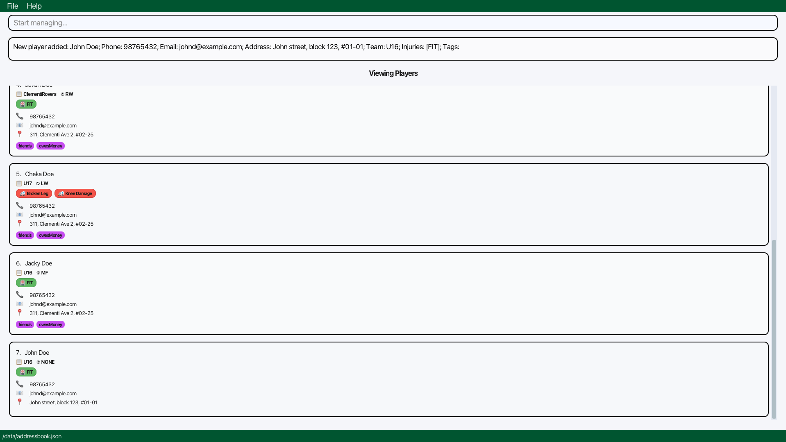
</box>


### Adding a position: `addposition`

Adds a position to the PlayBook.

Format: `addposition ps/POSITION_NAME`

**Requirements:**
* `POSITION_NAME` must not be the same as an existing position in the PlayBook.

<box type="tip" seamless>

**Tip:** Create standard football positions like GK (Goalkeeper), CB (Center Back), LW (Left Wing), ST (Striker), etc. for easier team management.
</box>

**Examples:**
* `addposition ps/LW` - Creates position named `LW`
* `addposition ps/ST` - Creates position named `ST`
* `addposition ps/GK` - Creates position named `GK`

<box type="info" seamless>

**Expected output:** "Position LW has been created successfully!" (or the position name you specified)

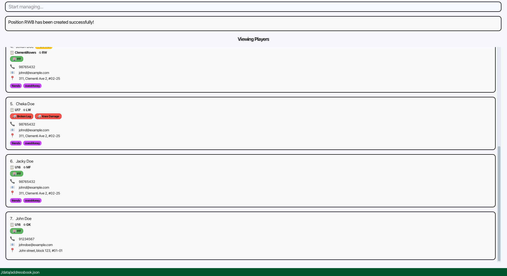
</box>

### Assign player to team: `assignteam`

Assigns an existing player to another existing team.

Format: `assignteam pl/PLAYER_NAME tm/TEAM_NAME`

**Requirements:**
* `PLAYER_NAME` must be an existing player in the PlayBook.
* `TEAM_NAME` must be an existing team in the PlayBook. Use the `addteam` command to add a team first.
* `PLAYER_NAME` must not already be assigned to `TEAM_NAME`.

<box type="warning" seamless>

**Important: Captain Status Removal**

When a player who is captain of their current team is reassigned to a new team, they will **automatically lose their captain status**. 
This prevents having multiple captains in the same team. 
You will be notified when this happens, and you can reassign captaincy using the `assigncaptain` command if needed.
</box>

<box type="tip" seamless>

**Tip:** Use this command when promoting players between age groups (e.g., moving a player from U16 to U18) or reassigning players to different squads.
</box>

**Examples:**
* `assignteam pl/John Doe tm/U16` - Moves John Doe to the U16 team
* `assignteam pl/Betsy Crowe tm/U18` - Moves Betsy Crowe to the U18 team

<box type="info" seamless>

**Expected output:**

**For non-captain players:** "Player: John Doe has been successfully assigned to Team: U16!"

**For captain players:** "Player: John Doe has been successfully assigned to Team: U16!<br>John Doe has been stripped of captaincy from their previous team."

Switches to the `Viewing Players` panel if not already in it.

The player's team will be immediately updated in their player card, and if they were a captain, the captain badge will be removed.

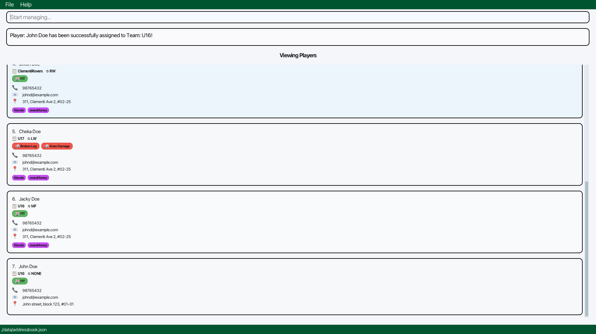
</box>

### Assigning a position to player: `assignposition`

Assigns an existing position to an existing player in the PlayBook.

Format: `assignposition pl/PLAYER_NAME ps/POSITION_NAME`

**Requirements:**
* `PLAYER_NAME` must be an existing player in the PlayBook.
* `POSITION_NAME` must be an existing position in the PlayBook. Use the `addposition` command to add a position first.
* The player must not already be assigned to the same position.

<box type="warning" seamless>

**Warning:** You must create the position first using `addposition` before assigning it to players. If the position doesn't exist, you'll get an error message.
</box>

<box type="tip" seamless>

**Tip:** Players can be assigned multiple positions. Use this feature to track versatile players who can play in different roles.
</box>

**Examples:**
* `assignposition pl/John Doe ps/LW` - Assigns `LW` position to John Doe
* `assignposition pl/Musiala ps/ST` - Assigns `ST` position to Musiala

<box type="info" seamless>

**Expected output:** "John Doe has been successfully assigned position GK!"

Switches to the `Viewing Players` panel if not already in it.

The position will be immediately visible in the player's card.

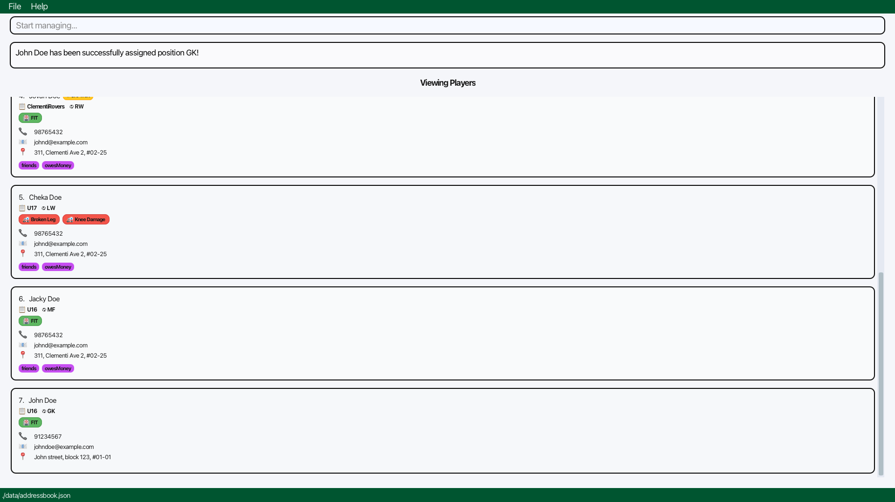
</box>

### Assign injury to player: `assigninjury`

Assigns an injury status to an existing player.

Format: `assigninjury pl/PLAYER_NAME i/INJURY`

**Requirements:**
* `PLAYER_NAME` must be an existing player in the PlayBook.

<box type="warning" seamless>

**Warning:** The keyword `FIT` (in any letter case) is not allowed as a valid injury. Use `unassigninjury` instead to restore the player's injury status to `FIT`.
</box>

<box type="tip" seamless>

**Tips:**
* Players can have multiple concurrent injuries. Simply use `assigninjury` multiple times with different injury names.
* Use specific injury names (e.g., "ACL", "hamstring strain", "ankle sprain") for better tracking.
* After assigning an injury, use `listinjured` to see all injured players at a glance.
</box>

**Examples:**
* `assigninjury pl/John Doe i/ACL` - Marks John Doe with an ACL injury
* `assigninjury pl/Musiala i/fibula fracture` - Marks Musiala with a fibula fracture
* `assigninjury pl/John Doe i/hamstring strain` - Adds a second injury to John Doe

<box type="info" seamless>

**Expected output:** "Assigned injury ACL to John Doe"

Switches to the `Viewing Players` panel if not already in it.

The player's injury status will be updated immediately in their player card.

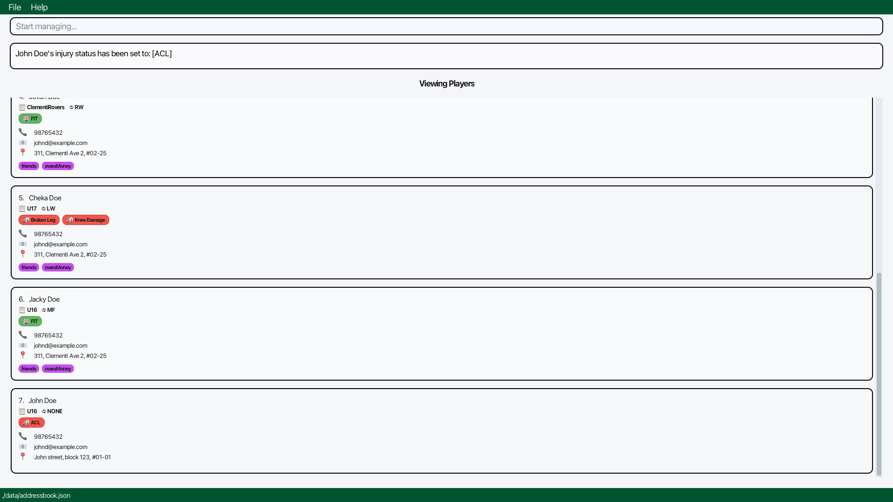
</box>

### Assigning player as captain: `assigncaptain`

Assigns an existing player in the PlayBook to be captain.

Format: `assigncaptain pl/PLAYER_NAME`

**Requirements:**
* `PLAYER_NAME` must be an existing player in the PlayBook.
* The player must not already be an assigned captain.
* **Only one captain per team is allowed** - when you assign a new captain to a team that already has a captain, the previous captain will automatically be stripped of their captaincy.

<box type="tip" seamless>

**Tips:**
* Each team can have only one captain at a time. If you assign a new captain, the old captain will be automatically removed.
* Use `listcaptain` to see all current team captains.
* **Captain status is team-specific**: If a captain is reassigned to a different team using `assignteam`, they will automatically lose their captain status. You'll need to use `assigncaptain` again if you want them to be captain of their new team.
</box>

**Examples:**
* `assigncaptain pl/John Doe` - Assigns John Doe as captain.
* `assigncaptain pl/Sergio Ramos` - Assigns Sergio Ramos as captain. Unassigns the previous captain.

<box type="info" seamless>

**Expected output:** "John Doe is now a captain of U16"

A captain badge or indicator will appear on the player's card.

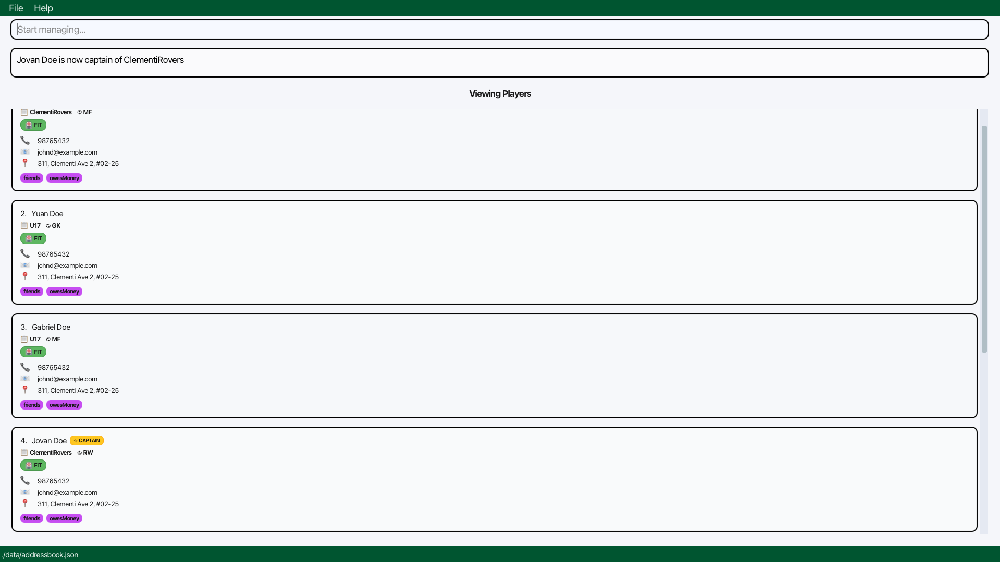
</box>

### Deleting a player, team or position: `delete`

Deletes the specified player, team or position from the PlayBook.

Format: `delete [pl/PLAYER_NAME] [tm/TEAM_NAME] [ps/POSITION_NAME]`

**Requirements:**
* You must provide **exactly one** parameter (either `pl/`, `tm/`, or `ps/`).
* The player, team or position to be deleted must exist in the PlayBook.

<box type="warning" seamless>

**Warning:** This action cannot be undone!
- **Deleting a player**: The player and all their information (team, position, injuries, tags) will be permanently removed.
- **Deleting a team**: You can only delete a team if there are no players assigned to it. Please remove all players from the team before attempting to delete it.
- **Deleting a position**: You can only delete a position if it is not assigned to any players. Please unassign the position from all players before attempting to delete it.

Consider making a backup of your data file before bulk deletions.
</box>

<box type="info" seamless>

**Note:** The command can only delete one player, team or position at a time.
</box>

**Examples:**
* `delete pl/John Doe` - Permanently deletes player John Doe from PlayBook
* `delete tm/U16` - Deletes the U16 team from PlayBook (only if no players are assigned)
* `delete ps/LW` - Deletes LW position from PlayBook

<box type="info" seamless>

**Expected output:**

**For player deletion:** "Deleted Player: John Doe; Phone: 98765432; Email: johnd@example.com; Address: John street, block 123, #01-01; Team: U16; Injury: FIT; Position: LW; Tags: "

The player card will immediately disappear from the player list.

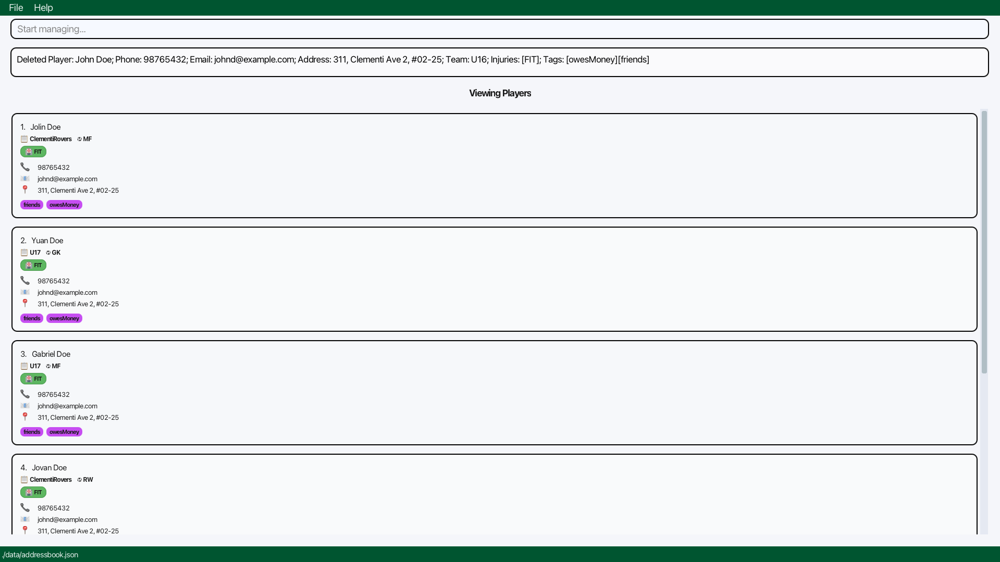

**For team deletion:** "Team U16 has been deleted successfully!"


**For position deletion:** "Position: LW has been deleted successfully!"

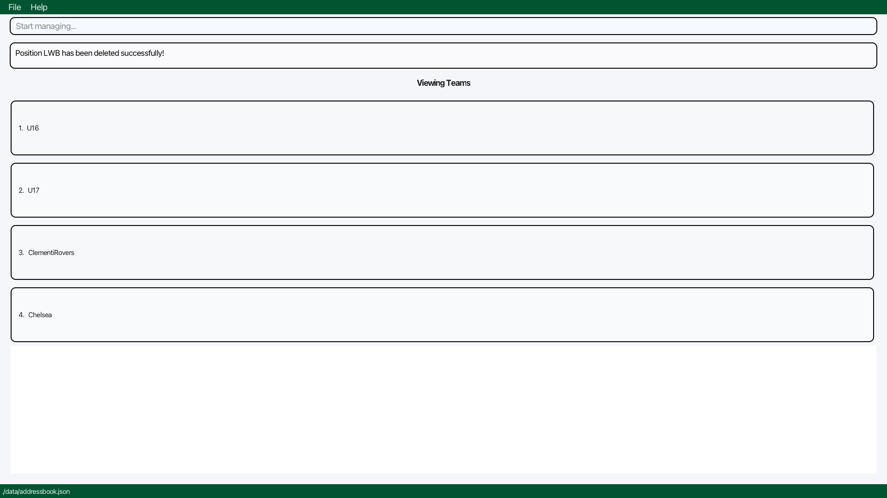
</box>

### Unassign injury from player: `unassigninjury`

Removes an injury status currently assigned to an existing player.

Format: `unassigninjury pl/PLAYER_NAME i/INJURY`

**Requirements:**
* `PLAYER_NAME` must be an existing player in the PlayBook.
* `INJURY` must match an injury that is already assigned to the specified player.
* The player must not already have the default `FIT` status.

<box type="tip" seamless>

**Tips:**
* If the player has multiple injuries, removing one injury will keep the others. Only when all injuries are removed will the status return to `FIT`.
* The injury name must match exactly (case-insensitive) with what was assigned.
* Use `listinjured` to check current injury statuses before unassigning.
</box>

**Examples:**
* `unassigninjury pl/John Doe i/ACL` - Removes the ACL injury from John Doe
* `unassigninjury pl/Musiala i/fibula fracture` - Removes the fibula fracture from Musiala

<box type="info" seamless>

**Expected output:** "Removed injury ACL from John Doe"

Switches to the `Viewing Players` panel if not already in it.

If the player has no other injury status, their status will automatically return to "FIT".


</box>

### Unassigning player as captain: `stripcaptain`

Removes captain status from an existing player in the PlayBook.

Format: `stripcaptain pl/PLAYER_NAME`

**Requirements:**
* `PLAYER_NAME` must be an existing player in the PlayBook.
* The player must already be an assigned captain.

**Examples:**
* `stripcaptain pl/John Doe` - Removes captain status from John Doe
* `stripcaptain pl/Sergio Ramos` - Removes captain status from Sergio Ramos

<box type="info" seamless>

**Expected output:** "John Doe is no longer team captain."

The captain badge/indicator will be removed from the player's card.


</box>

### Editing a player: `edit`

Edits an existing player in the PlayBook. Existing values will be updated to the input values.

Format: `edit pl/PLAYER_NAME [n/NEW_PLAYER_NAME] [p/PHONE] [e/EMAIL] [a/ADDRESS] [tm/TEAM_NAME] [t/TAG]…​`

**Requirements:**
* At least one of the optional fields must be provided.
* `PLAYER_NAME` must be an existing player in the PlayBook.
* `NEW_PLAYER_NAME` must not be the same as an existing player in the PlayBook.
* `TEAM_NAME` must be an existing team in the PlayBook. Use the `addteam` command to add a team first.
<box type="warning" seamless>

**Warning:** When editing tags, all existing tags will be replaced with the new ones. If you want to keep existing tags, you must include them in the edit command.
</box>

<box type="tip" seamless>

**Tips:**
* You can edit multiple fields at once (e.g., both phone and email).
* To remove all tags, use `t/` without any tag names after it.
* You cannot edit injury status or position through this command - use dedicated commands instead.
</box>

**Examples:**
* `edit pl/John Doe p/91234567 e/johndoe@example.com` - Updates phone and email
* `edit pl/John Doe n/Betsy Crower t/` - Renames player and removes all tags
* `edit pl/John Doe tm/U18 t/captain t/veteran` - Moves to U18 team and adds tags

<box type="info" seamless>

**Expected output:** "Edited Player: John Doe; Phone: 91234567; Email: johndoe@example.com; Address: John street, block 123, #01-01; Team: U16; Injuries: [FIT]; Tags: "

The player card will immediately reflect all changes.

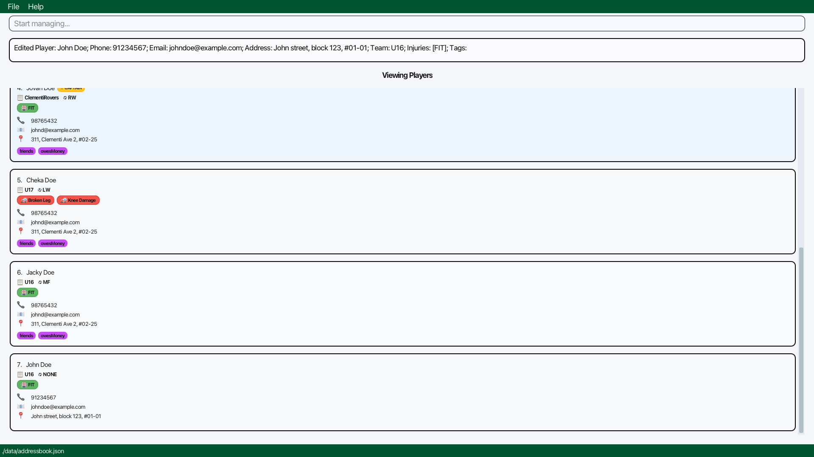
</box>

### Locating players by name: `find`

Finds players whose names contain any of the given keywords.

Format: `find KEYWORD [MORE_KEYWORDS]`

**Requirements:**
* Keywords will only match full words e.g. `Han` will not match `Hans`.
* Players matching at least one keyword will be returned (i.e. `OR` search).
  e.g. `Hans Bo` will return `Hans Gruber`, `Bo Yang`.

<box type="tip" seamless>

**Tips:**
* Use `find` when you remember part of a player's name but not the full name.
* To return to viewing all players after a search, use the `list` command.
* For more advanced filtering by team, position, or injury, use the `filter` command instead.
</box>

**Examples:**
* `find John` - Returns players like "John Doe" and "John Smith"
* `find alex david` - Returns "Alex Yeoh" and "David Li" (matches either keyword)

<box type="info" seamless>

**Expected output:** "X persons listed!" where X is the number of matching players. The player list panel will show only the matching players.

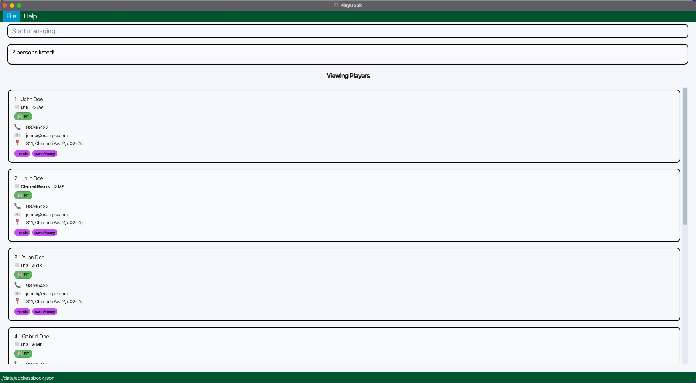
</box>

### Listing all players: `list`

Shows a list of all players in the PlayBook.

Format: `list`

<box type="tip" seamless>

**Tip:** Use this command to reset your view after using filters or searches. It displays all players regardless of team, position, or injury status.
</box>

<box type="info" seamless>

**Expected output:** All players in your PlayBook will be displayed in the player list panel.


</box>

### Listing all captains: `listcaptain`

Shows a list of all captains in the PlayBook.

Format: `listcaptain`

<box type="tip" seamless>

**Tip:** Useful for quickly identifying team leaders across all your squads.
</box>

<box type="info" seamless>

**Expected output:** Only players designated as captains will be displayed in the player list panel.


</box>

### Listing all teams: `listteam`

Shows a list of all teams in the PlayBook.

Format: `listteam`

<box type="tip" seamless>

**Tip:** Use this to quickly see all teams you've created. Helpful for verifying team names before adding new players.
</box>

<box type="info" seamless>

**Expected output:** A list of all team names will be displayed in the result box (e.g., "U16, U18, Reserves").


</box>

### Listing all positions: `listposition`

Shows a list of all positions in the PlayBook.

Format: `listposition`

<box type="tip" seamless>

**Tip:** Use this to check which positions you've already created before assigning positions to players.
</box>

<box type="info" seamless>

**Expected output:** A list of all position names will be displayed (e.g., "LW, ST, GK, CB").

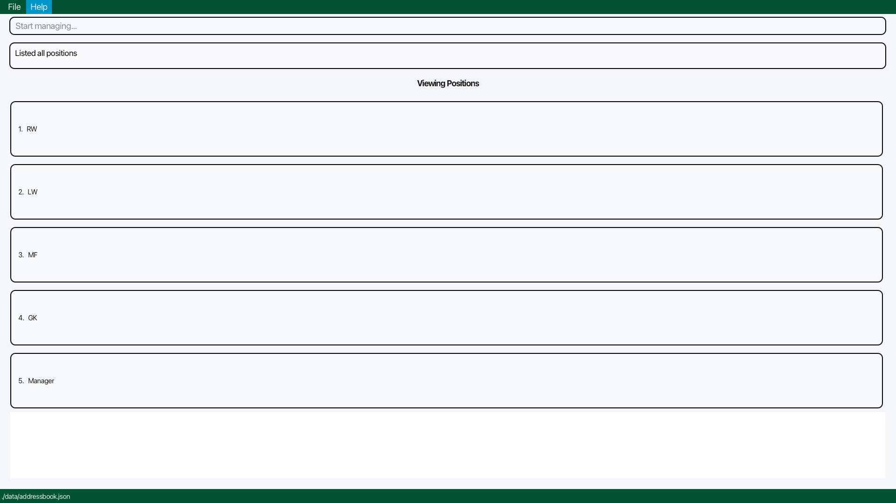
</box>

### Listing all injured players: `listinjured`

Shows a list of all injured players in the PlayBook.

Format: `listinjured`

<box type="tip" seamless>

**Tips:**
* Use this command before match day to quickly see who's unavailable.
* Combine with team information in the player cards to see which teams are affected by injuries.
* This shows all players with any injury status (not "FIT").
</box>

<box type="info" seamless>

**Expected output:** Only players with injuries (non-FIT status) will be displayed in the player list panel. Their injury details will be visible on their player cards.

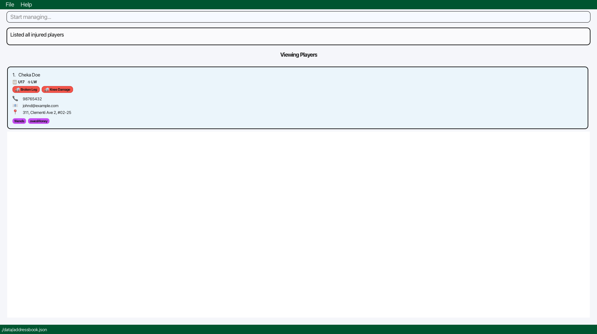
</box>

### Filtering players by team, injury and/or position: `filter`

Filter players by team, injury and/or position.

Format: `filter [tm/TEAM_NAME] [i/INJURY] [ps/POSITION_NAME]`

**Requirements:**
* At least one of the optional fields must be provided.
* `TEAM_NAME` must be an existing team in the PlayBook. Use the `addteam` command to add a team first.
* `POSITION_NAME` must be an existing position in the PlayBook. Use the `addposition` command to add a position first.
* `INJURY` will only match full words e.g. `ACL` will not match `ACLS`.
* `INJURY` matching at least one keyword will be returned (i.e. `OR` search).
  e.g. `Leg Arm` will return `Leg Broken`, `Arm Fractured`.

<box type="tip" seamless>

**Tips:**
* **Pre-match planning**: Use `filter tm/U16 i/FIT` to see all available U16 players.
* **Position planning**: Use `filter ps/ST i/FIT` to find all fit strikers across teams.
* **Injury tracking**: Use `filter tm/U18 i/ACL` to see all U18 players with ACL injuries.
* Combine multiple filters for precise results. All conditions must be met (AND logic).
</box>

**Examples:**
* `filter tm/U16 ps/FW` - Shows U16 players who play Forward
* `filter ps/FW tm/U17 i/FIT` - Shows fit Forwards from U17 team
* `filter i/Leg Broken ps/MF` - Shows Midfielders with leg broken injury
* `filter tm/Chelsea` - Shows all Chelsea team players
* `filter tm/Manchester i/Leg Arm` - Shows all Manchester team players with an injuries with the words Leg or Arm in them

<box type="info" seamless>

**Expected output:** "X persons listed!" where X is the number of players matching all filter criteria. Only matching players will be displayed.


</box>

### Clearing all entries: `clear`

Clears all entries from the PlayBook.

Format: `clear`

<box type="warning" seamless>

**WARNING: IRREVERSIBLE ACTION!**

This command will permanently delete:
* All players and their information
* All teams
* All positions
* All assignments (injuries, captaincy, etc.)

**There is no undo.** Make sure you have a backup of your data file (located under `/data/addressbook.json`) before using this command!
</box>

<box type="tip" seamless>

**Tip:** Use this command at the start of a new season to begin with a clean slate, but always backup your previous season's data first.

</box>

<box type="info" seamless>

**Expected output:** "Address book has been cleared!"

The player list panel will be completely empty.
</box>

### Exiting the program: `exit`

Exits the program.

Format: `exit`

<box type="info" seamless>

**Expected output:** The PlayBook application window will close immediately. Your data is safely stored in `addressbook.json`.
</box>

### Saving the data

PlayBook data are saved in the hard disk automatically after any command that changes the data. There is no need to save manually.

<box type="tip" seamless>

**Tip:** Find your data at `/data/addressbook.json`

</box>

### Editing the data file

PlayBook data are saved automatically as a JSON file `/data/addressbook.json`. Advanced users are welcome to update data directly by editing that data file.

<box type="warning" seamless>

**Caution:**
* If your changes to the data file make its format invalid, PlayBook will discard all data and start with an empty data file at the next run.
* Always make a backup of the file before editing it manually.
* Certain edits can cause PlayBook to behave in unexpected ways (e.g., if a value entered is outside the acceptable range).
* Only edit the data file if you are confident that you can update it correctly.
</box>

### Archiving data files `[coming in v2.0]`

_Details coming soon ..._

--------------------------------------------------------------------------------------------------------------------

## FAQ

**Q: How do I transfer my data to another Computer?**<br>
**A:** Install the app in the other computer and overwrite the empty data file it creates with the file that contains the data of your previous PlayBook home folder.

**Q: What happens if I accidentally delete a player?**<br>
**A:** Unfortunately, there's no undo feature.

**Q: Can a player be in multiple teams?**<br>
**A:** No, each player can only be assigned to one team at a time. If you need to move a player to a different team, use the `assignteam` command.

**Q: What happens to a captain when they change teams?**<br>
**A:** When a captain is reassigned to a new team using `assignteam`, they automatically lose their captain status. This prevents having multiple captains on the same team. You will receive a notification message when this happens. If you want them to be captain of their new team, use the `assigncaptain` command after the team change.

**Q: How do I quickly find all available players for a match?**<br>
**A:** Use the `filter i/FIT` command to show only players with no injuries. You can combine this with team filtering: `filter tm/U16 i/FIT` to see all fit players in the U16 team.

**Q: Can I track multiple injuries for one player?**<br>
**A:** Yes! Players can have multiple concurrent injuries. Use `assigninjury` multiple times for different injuries, and use `unassigninjury` to remove specific injuries when they recover.

**Q: What if I make a typo in a player's name?**<br>
**A:** Use the `edit` command to correct it. For example: `edit pl/Jon Doe n/John Doe` will rename "Jon Doe" to "John Doe".

**Q: Why can't I delete a team?**<br>
**A:** Teams can only be deleted if they have no players assigned. First reassign all players to other teams using `assignteam`, or delete the players, then delete the team using `deleteteam`.

**Q: Does PlayBook work offline?**<br>
**A:** Yes! PlayBook works completely offline and stores all data locally on your computer.

--------------------------------------------------------------------------------------------------------------------

## Known issues

1. **When using multiple screens**, if you move the application to a secondary screen, and later switch to using only the primary screen, the GUI will open off-screen. The remedy is to delete the `preferences.json` file created by the application before running the application again.
2. **If you minimize the Help Window** and then run the `help` command (or use the `Help` menu, or the keyboard shortcut `F1`) again, the original Help Window will remain minimized, and no new Help Window will appear. The remedy is to manually restore the minimized Help Window.

--------------------------------------------------------------------------------------------------------------------

## Command summary

| Action                              | Format, Examples                                                                                                                                                                                               |
|-------------------------------------|----------------------------------------------------------------------------------------------------------------------------------------------------------------------------------------------------------------|
| **Help**                            | `help`                                                                                                                                                                                                         |
| **Add Team**                        | `addteam tm/TEAM_NAME` <br> e.g., `addteam tm/u16`                                                                                                                                                             |
| **Add Player**                      | `add pl/PLAYER_NAME p/PHONE_NUMBER e/EMAIL a/ADDRESS tm/TEAM_NAME [t/TAG]…` <br> e.g., `add pl/James Ho p/22224444 e/jamesho@example.com a/123, Clementi Rd, 1234665 tm/u16 t/friend t/colleague`              |
| **Add Position**                    | `addposition ps/POSITION_NAME` <br> e.g., `addposition ps/LW`                                                                                                                                                  |
| **Assign Player to Team**           | `assignteam pl/PLAYER_NAME tm/TEAM_NAME` <br> e.g., `assignteam pl/John Doe tm/u16`                                                                                                                            |
| **Assign Position to Player**       | `assignposition pl/PLAYER_NAME ps/POSITION_NAME` <br> e.g., `assignposition pl/John Doe ps/LW`                                                                                                                 |
| **Assign Injury to Player**         | `assigninjury pl/PLAYER_NAME i/INJURY` <br> e.g., `assigninjury pl/John Doe i/ACL`                                                                                                                             |
| **Assign Captain**                  | `assigncaptain pl/PLAYER_NAME` <br> e.g., `assigncaptain pl/John Doe`                                                                                                                                          |
| **Delete Player, Team or Position** | `delete [pl/PLAYER_NAME] [tm/TEAM_NAME] [ps/POSITION_NAME]`<br> e.g., `delete pl/James Ho`, `delete tm/u16`, `delete ps/LW`                                                                                    |
| **Unassign Injury from Player**     | `unassigninjury pl/PLAYER_NAME` <br> e.g., `unassigninjury pl/John Doe`                                                                                                                                        |
| **Strip Captain**                   | `stripcaptain pl/PLAYER_NAME` <br> e.g., `stripcaptain pl/John Doe`                                                                                                                                            |
| **Edit**                            | `edit pl/PLAYER_NAME [n/NEW_PLAYER_NAME] [p/PHONE] [e/EMAIL] [a/ADDRESS] [tm/TEAM_NAME] [i/INJURY] [t/TAG]…`<br> e.g.,`edit pl/John Doe n/James Lee e/jameslee@example.com`                                    |
| **Find**                            | `find KEYWORD [MORE_KEYWORDS]`<br> e.g., `find James Jake`                                                                                                                                                     |
| **List**                            | `list`                                                                                                                                                                                                         |
| **List Captains**                   | `listcaptain`                                                                                                                                                                                                  |
| **List Teams**                      | `listteam`                                                                                                                                                                                                     |
| **List Positions**                  | `listposition`                                                                                                                                                                                                 |
| **List Injured Players**            | `listinjured`                                                                                                                                                                                                  |
| **Filter Players**                  | `filter [tm/TEAM_NAME] [i/INJURY] [ps/POSITION]`<br> e.g.,`filter tm/U16 i/ACL ps/FW`                                                                                                                          |
| **Clear**                           | `clear`                                                                                                                                                                                                        |
