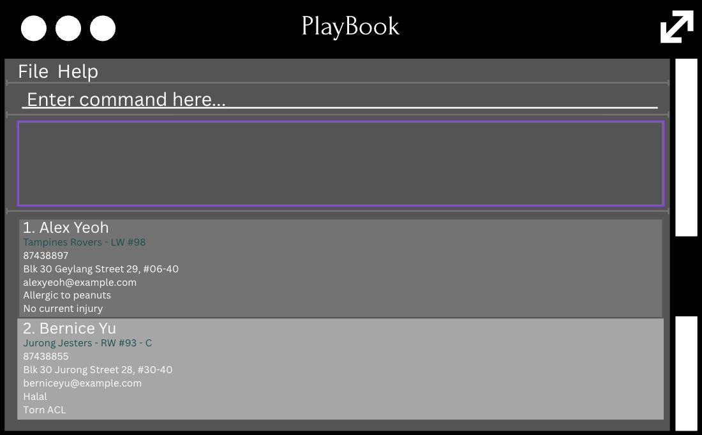

# PlayBook User Guide

PlayBook (PB) is a **desktop app for semi-professional youth football coaches to manage their players' contacts, optimized for use via a Command Line Interface** (CLI) while still having the benefits of a Graphical User Interface (GUI). If you can type fast, PB can get your contact management tasks done faster than traditional GUI apps.

<!-- * Table of Contents -->

- [PlayBook User Guide](#playbook-user-guide)
  - [Quick start](#quick-start)
  - [Features](#features)
    - [Viewing help: `help`](#viewing-help-help)
    - [Adding a team: `addteam`](#adding-a-team-addteam)
    - [Adding a player: `add`](#adding-a-player-add)
    - [Assign player to team: `assignteam`](#assign-player-to-team-assignteam)
    - [Assign injury to player: `assigninjury`](#assign-injury-to-player-assigninjury)
    - [Unassign injury from player: `unassigninjury`](#unassign-injury-from-player-unassigninjury)
    - [Listing all players: `list`](#listing-all-players-list)
    - [Listing all teams: `listteams`](#listing-all-teams-listteams)
    - [Editing a player: `edit`](#editing-a-player-edit)
    - [Locating players by name: `find`](#locating-players-by-name-find)
    - [Filtering players by team, injury and/or position: `filter`](#filtering-players-by-team-injury-andor-position-filter)
    - [Deleting a player: `delete`](#deleting-a-player-delete)
    - [Deleting a team: `deleteteam`](#deleting-a-team-deleteteam)
    - [Clearing all entries : `clear`](#clearing-all-entries--clear)
    - [Exiting the program : `exit`](#exiting-the-program--exit)
    - [Saving the data](#saving-the-data)
    - [Editing the data file](#editing-the-data-file)
    - [Archiving data files `[coming in v2.0]`](#archiving-data-files-coming-in-v20)
  - [FAQ](#faq)
  - [Known issues](#known-issues)
  - [Command summary](#command-summary)

<page-nav-print />

--------------------------------------------------------------------------------------------------------------------

## Quick start

1. Ensure you have Java `17` or above installed in your Computer. 
   **Mac users:** Ensure you have the precise JDK version prescribed [here](https://se-education.org/guides/tutorials/javaInstallationMac.html).

1. Download the latest `.jar` file from [here](https://github.com/AY2526S1-CS2103T-T13-3/tp/releases).

1. Copy the file to the folder you want to use as the _home folder_ for your PlayBook.

1. Open a command terminal, `cd` into the folder you put the jar file in, and use the `java -jar playbook.jar` command to run the application. 
   A GUI similar to the below should appear in a few seconds. Note how the app contains some sample data. 
   

1. Type the command in the command box and press Enter to execute it. e.g. typing **`help`** and pressing Enter will open the help window. 
   Some example commands you can try:

   * `list` : Lists all players.
   
   * `addteam tm/u16`: Adds a team named `u16` to the PlayBook.

   * `add n/John Doe p/98765432 e/johnd@example.com a/John street, block 123, #01-01 tm/u16` : Adds a player named `John Doe` to the PlayBook (make sure to add the team `u16` first).

   * `assigninjury pl/John Doe i/ACL` : Assigns an injury status of `ACL` to `John Doe` from the PlayBook. 

   * `delete pl/John Doe` : Deletes `John Doe` from the PlayBook.

   * `clear` : Deletes all players' contacts and teams from the PlayBook.

   * `exit` : Exits the app.

1. Refer to the [Features](#features) below for details of each command.

--------------------------------------------------------------------------------------------------------------------

## Features

<box type="info" seamless>

**Notes about the command format:** 

* Words in `UPPER_CASE` are the parameters to be supplied by the user. 
  e.g. in `add n/NAME`, `NAME` is a parameter which can be used as `add n/John Doe`.

* Items in square brackets are optional. 
  - e.g `n/NAME [t/TAG]` can be used as `n/John Doe t/friend` or as `n/John Doe`.
  - e.g `n/NAME [i/INJURY]` can be used as `n/John Doe i/ACL` or as `n/John Doe`. 

* Items with `…`​ after them can be used multiple times including zero times. 
  e.g. `[t/TAG]…​` can be used as ` ` (i.e. 0 times), `t/friend`, `t/friend t/family` etc.

* Parameters can be in any order. 
  e.g. if the command specifies `n/NAME p/PHONE_NUMBER`, `p/PHONE_NUMBER n/NAME` is also acceptable.

* Extraneous parameters for commands that do not take in parameters (such as `help`, `list`, `exit` and `clear`) will be ignored. 
  e.g. if the command specifies `help 123`, it will be interpreted as `help`.

* If you are using a PDF version of this document, be careful when copying and pasting commands that span multiple lines as space characters surrounding line-breaks may be omitted when copied over to the application.
</box>

### Viewing help: `help`

Shows a message explaining how to access the help page.

Format: `help`

### Adding a team: `addteam`

Adds a team to the PlayBook.

Format: `addteam tm/TEAM_NAME`

* `TEAM_NAME` must not be the same as an existing team in the PlayBook.
* `TEAM_NAME` should contain only alphanumeric characters, with no spaces.
* `TEAM_NAME` is case-insensitive, e.g. `u16` is the same as `U16`.
* `TEAM_NAME` should not be blank.

Examples:
* `addteam tm/u16`

### Adding a player: `add`

Adds a player to the PlayBook.

Format: `add n/NAME p/PHONE_NUMBER e/EMAIL a/ADDRESS tm/TEAM_NAME [i/INJURY] [t/TAG]…​`

* `NAME` should contain alphanumeric characters and spaces only.
* `NAME` should not be blank.
* `NAME` is case-insensitive, e.g. `john doe` is the same as `John Doe`.
* `NAME` must not be the same as an existing player in the PlayBook.
* `PHONE_NUMBER` should only contain numbers.
* `PHONE_NUMBER` should be at least 3 digits long.
* `PHONE_NUMBER` should not be blank.
* `EMAIL` should not be blank.
* `ADDRESS` should not be blank.
* `TEAM_NAME` must be an existing team in the PlayBook. Use the `addteam` command to add a team first.
* `TEAM_NAME` should contain only alphanumeric characters, with no spaces.
* `TEAM_NAME` is case-insensitive, e.g. `u16` is the same as `U16`.
* `TEAM_NAME` should not be blank.
* `INJURY` is case-insensitive, e.g. `acl` is the same as `ACL`.
* `INJURY` should contain alphanumeric characters and spaces only.
* `TAG` should contain alphanumeric characters only.

<box type="tip" seamless>

**Tip:** A player can have any number of tags (including 0).

**Tip:** A player may or may not have a specified injury.
</box>

Examples:
* `add n/John Doe p/98765432 e/johnd@example.com a/John street, block 123, #01-01 tm/u16`
* `add n/Betsy Crowe t/friend e/betsycrowe@example.com tm/u16 a/Newgate Prison p/1234567 i/ACL t/criminal`

### Assign player to team: `assignteam`

Assigns an existing player to another existing team.

Format: `assignteam pl/PLAYER_NAME tm/TEAM_NAME`

* `TEAM_NAME` must be an existing team in the PlayBook. Use the `addteam` command to add a team first.
* `TEAM_NAME` should contain only alphanumeric characters, with no spaces.
* `TEAM_NAME` is case-insensitive, e.g. `u16` is the same as `U16`.
* `TEAM_NAME` should not be blank.
* `PLAYER_NAME` must be the same as an existing player in the PlayBook.
* `PLAYER_NAME` is case-insensitive, e.g. `john doe` is the same as `John Doe`.
* `PLAYER_NAME` should not be blank.
* `PLAYER_NAME` must not already be assigned to `TEAM_NAME`.

Examples:
* `assignteam pl/John Doe tm/u16`
* `assignteam pl/Betsy Crowe tm/u16`

### Assign injury to player: `assigninjury`

Assigns an injury status to an existing player.

Format: `assigninjury pl/PLAYER_NAME i/INJURY`

* `PLAYER_NAME` must be the same as an existing player in the PlayBook.
* `PLAYER_NAME` is case-insensitive, e.g. `john doe` is the same as `John Doe`.
* `PLAYER_NAME` should not be blank.
* `INJURY` is case-insensitive, e.g. `acl` is the same as `ACL`.
* `INJURY` should not be blank.
* `INJURY` should contain alphanumeric characters and spaces only.

Examples:
* `assigninjury pl/John Doe i/ACL` assigns the injury status `ACL` to `John Doe` in the PlayBook.
* `assigninjury pl/Musiala i/fibula fracture` assigns the injury status `fibula fracture` to `Musiala` in the PlayBook.

### Unassign injury from player: `unassigninjury`

Removes the injury status currently assigned to an existing player. 

Format: `unassigninjury pl/PLAYER_NAME`

* `PLAYER_NAME` must be the same as an existing player in the PlayBook.
* `PLAYER_NAME` is case-insensitive, e.g. `john doe` is the same as `John Doe`.
* `PLAYER_NAME` should not be blank.
* Resets the injury status of the player to the default `FIT` status.
* The player must not already have the default `FIT` status.

Examples:
* `unassigninjury pl/John Doe` removes the injury status currently assigned to `John Doe` and resets it to the default `FIT` status.
* `unassigninjury pl/Musiala` removes the injury status currently assigned to `Musiala` and resets it to the default `FIT` status.

### Listing all players: `list`

Shows a list of all players in the PlayBook.

Format: `list`

### Listing all teams: `listteam`

Shows a list of all teams in the PlayBook.

Format: `listteam`

### Listing all positions: `listposition`

Shows a list of all positions in the PlayBook.

Format: `listposition`

### Listing all injured players: `listinjured`

Shows a list of the injured players in the PlayBook.

Format: `listinjured`

### Editing a player: `edit`

Edits an existing player in the PlayBook.

Format: `edit pl/PLAYER_NAME [n/NAME] [p/PHONE] [e/EMAIL] [a/ADDRESS] [tm/TEAM_NAME] [i/INJURY] [t/TAG]…​`

* Edits the player with the specified `PLAYER_NAME` from the PlayBook.
* At least one of the optional fields must be provided.
* Existing values will be updated to the input values.
* When editing the `NAME`, `TEAM_NAME`, or `INJURY` fields, comparisons are case-insensitive, i.e., values differing only by letter case are treated as identical.
* When editing tags, the existing tags of the player will be removed i.e, adding of tags is not cumulative.
* You can remove all the player's tags by typing `t/` without specifying any tags after it.
* `PLAYER_NAME` must be the same as an existing player in the PlayBook.
* `PLAYER_NAME` is case-insensitive, e.g. `john doe` is the same as `John Doe`.
* `PLAYER_NAME` should not be blank.
* `NAME` should contain alphanumeric characters and spaces only.
* `NAME` is case-insensitive, e.g. `john doe` is the same as `John Doe`.
* `NAME` must not be the same as an existing player in the PlayBook.
* `PHONE_NUMBER` should only contain numbers.
* `PHONE_NUMBER` should be at least 3 digits long.
* `TEAM_NAME` must be an existing team in the PlayBook. Use the `addteam` command to add a team first.
* `TEAM_NAME` should contain only alphanumeric characters, with no spaces.
* `TEAM_NAME` is case-insensitive, e.g. `u16` is the same as `U16`.
* `TEAM_NAME` should not be blank.
* `INJURY` is case-insensitive, e.g. `acl` is the same as `ACL`.
* `INJURY` should contain alphanumeric characters and spaces only.
* `TAG` should contain alphanumeric characters only.

Examples:
*  `edit pl/John Doe p/91234567 e/johndoe@example.com` edits the phone number and email address of `John Doe` to be `91234567` and `johndoe@example.com` respectively.
*  `edit pl/John Doe n/Betsy Crower t/` edits the name of `John Doe` to be `Betsy Crower` and clears all existing tags.

### Locating players by name: `find`

Finds players whose names contain any of the given keywords.

Format: `find KEYWORD [MORE_KEYWORDS]`

* The search is case-insensitive. e.g `hans` will match `Hans`.
* The order of the keywords does not matter. e.g. `Hans Bo` will match `Bo Hans`.
* Only the name is searched.
* Only full words will be matched e.g. `Han` will not match `Hans`.
* Players matching at least one keyword will be returned (i.e. `OR` search).
  e.g. `Hans Bo` will return `Hans Gruber`, `Bo Yang`.

Examples:
* `find John` returns `john` and `John Doe`
* `find alex david` returns `Alex Yeoh`, `David Li` 
  

### Filtering players by team, injury and/or position: `filter`

Filter players by team, injury and/or position.

Format: `filter [tm/TEAM_NAME] [i/INJURY] [ps/POSITION]`

* Shows all the players that matches the specified `TEAM_NAME`, `POSITION` and/or `INJURY` if they are provided.
* At least one of the optional fields must be provided.
* Duplicate flags are not allowed.
* The fields are all case-insensitive. e.g `acl` will match `ACL`.
* The order of the keywords for the injury field does not matter. e.g. `Leg Broken` will match `Broken Leg`.
* Only full words will be matched by the injury field. `ACL` will not match `ACLs`.

Examples:
* `filter tm/U16 ps/FW` shows players that are from the team `U16` and play the position `FW`.
* `filter ps/FW tm/U17 i/FIT` shows players that are from the team `U17`, play the position `FW` and are `FIT`.
* `filter i/Leg Broken ps/MF` shows players that play the position `MF` and have their `Leg Broken`.
* `filter tm/Chelsea` shows players that are from the team `Chelsea`.

### Deleting a player: `delete`

Deletes the specified player from the PlayBook.

Format: `delete pl/PLAYER_NAME`

* Deletes the player with the specified `PLAYER_NAME` from the PlayBook.
* `PLAYER_NAME` is case-insensitive, e.g `hans` will match `Hans`.
* The player to be deleted must exist in the PlayBook.
* The command can only delete one player at a time.

Examples:
* `delete pl/John Doe` deletes the player named `John Doe` from the PlayBook.
* `delete pl/Betsy Crowe` deletes the player named `Betsy Crowe` from the PlayBook.

### Deleting a team: `deleteteam`

Deletes the specified team from the PlayBook.

Format: `deleteteam tm/TEAM_NAME`

* Deletes the team with the specified `TEAM_NAME` from the PlayBook.
* Team deletion is only allowed if there are no players assigned to the team, i.e. all players assigned to the team must be reassigned to other teams or deleted first.
* `TEAM_NAME` must be an existing team in the PlayBook.
* `TEAM_NAME` should contain only alphanumeric characters, with no spaces.
* `TEAM_NAME` is case-insensitive, e.g. `u16` is the same as `U16`.
* `TEAM_NAME` should not be blank.
* The team to be deleted must exist in the PlayBook.
* The command can only delete one team at a time.

Examples:
* `deleteteam tm/u16` deletes the team named `u16` from the PlayBook, assuming it exists.

### Clearing all entries : `clear`

Clears all entries from the PlayBook.

Format: `clear`

### Exiting the program : `exit`

Exits the program.

Format: `exit`

### Saving the data

PlayBook data are saved in the hard disk automatically after any command that changes the data. There is no need to save manually.

### Editing the data file

PlayBook data are saved automatically as a JSON file `[JAR file location]/data/addressbook.json`. Advanced users are welcome to update data directly by editing that data file.

<box type="warning" seamless>

**Caution:**
If your changes to the data file makes its format invalid, PlayBook will discard all data and start with an empty data file at the next run.  Hence, it is recommended to take a backup of the file before editing it. 
Furthermore, certain edits can cause the PlayBook to behave in unexpected ways (e.g., if a value entered is outside the acceptable range). Therefore, edit the data file only if you are confident that you can update it correctly.
</box>

### Archiving data files `[coming in v2.0]`

_Details coming soon ..._

--------------------------------------------------------------------------------------------------------------------

## FAQ

**Q**: How do I transfer my data to another Computer? 
**A**: Install the app in the other computer and overwrite the empty data file it creates with the file that contains the data of your previous PlayBook home folder.

--------------------------------------------------------------------------------------------------------------------

## Known issues

1. **When using multiple screens**, if you move the application to a secondary screen, and later switch to using only the primary screen, the GUI will open off-screen. The remedy is to delete the `preferences.json` file created by the application before running the application again.
2. **If you minimize the Help Window** and then run the `help` command (or use the `Help` menu, or the keyboard shortcut `F1`) again, the original Help Window will remain minimized, and no new Help Window will appear. The remedy is to manually restore the minimized Help Window.

--------------------------------------------------------------------------------------------------------------------

## Command summary

| Action                      | Format, Examples                                                                                                                                                                                      |
|-----------------------------|-------------------------------------------------------------------------------------------------------------------------------------------------------------------------------------------------------|
| **Add Player**              | `add n/NAME p/PHONE_NUMBER e/EMAIL a/ADDRESS tm/TEAM [i/INJURY] [t/TAG]…​`   e.g., `add n/James Ho p/22224444 e/jamesho@example.com a/123, Clementi Rd, 1234665 tm/u16 i/ACL t/friend t/colleague` |
| **Add Team**                | `addteam tm/NAME`   e.g., `addteam tm/u16`                                                                                                                                                         |
| **Assign Player to Team**   | `assignteam pl/PLAYER_NAME tm/TEAM_NAME`   e.g., `assignteam pl/John Doe tm/u16`                                                                                                                   |
| **Assign Injury to Player** | `assigninjury pl/PLAYER_NAME i/INJURY`   e.g., `assigninjury pl/John Doe i/ACL`                                                                                                                    |
| **Unassign Injury from Player** | `unassigninjury pl/PLAYER_NAME`   e.g., `unassigninjury pl/John Doe`                                                                                                                               |
| **Clear**                   | `clear`                                                                                                                                                                                               |
| **Delete Player**           | `delete pl/PLAYER`  e.g., `delete pl/James Ho`                                                                                                                                                     |
| **Delete Team**             | `deleteteam tm/TEAM`  e.g., `deleteteam tm/u16`                                                                                                                                                    |
| **Edit**                        | `edit pl/PLAYER_NAME [n/NAME] [p/PHONE] [e/EMAIL] [a/ADDRESS] [tm/TEAM_NAME] [i/INJURY] [t/TAG]…​`  e.g.,`edit pl/John Doe n/James Lee e/jameslee@example.com`                                     |
| **Find**                    | `find KEYWORD [MORE_KEYWORDS]`  e.g., `find James Jake`                                                                                                                                            |
| **Filter Players**          | `filter [tm/TEAM_NAME] [i/INJURY] [ps/POSITION]`  e.g.,`filter tm/U16 i/ACL ps/FW`                                                                                                                 |
| **List**                    | `list`                                                                                                                                                                                                |
| **List Teams**              | `listteam`                                                                                                                                                                                           |
| **List Positions**              | `listposition`                                                                                                                                                                                           |
| **List Injured Players**              | `listinjured`                                                                                                                                                                                           |
| **Help**                    | `help`                                                                                                                                                                                                |
